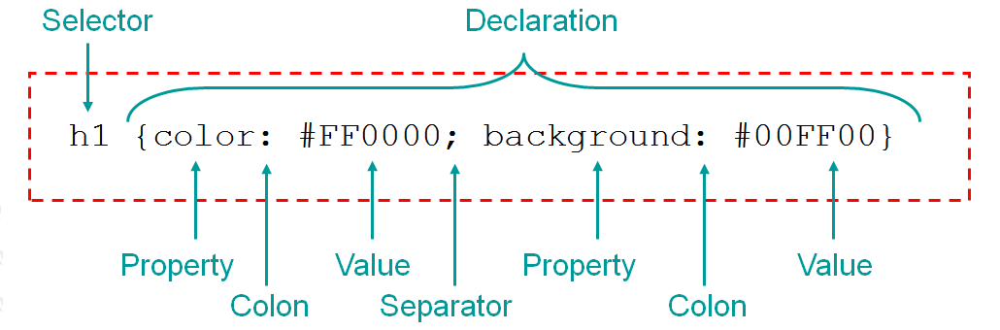
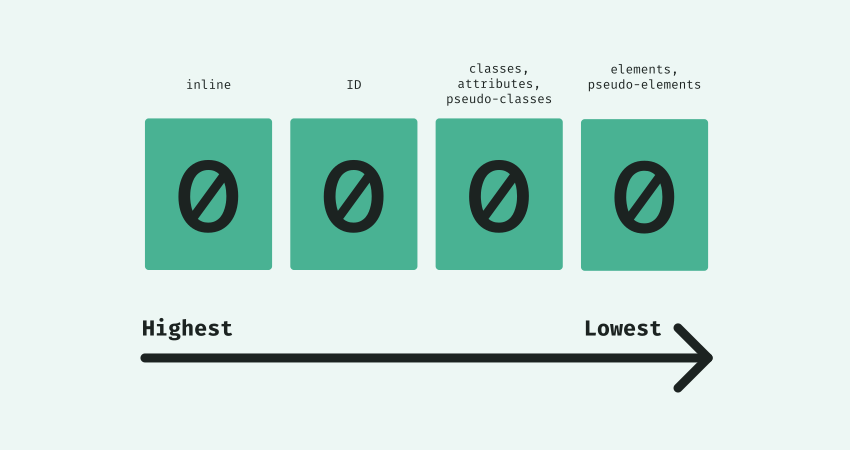

# CSS Basics

## Inhalt

* [Was ist CSS?](#was-ist-css)
* [Implementation von CSS](#implementation-von-css)
* [CSS Selektoren](#css-selektoren)
* [CSS Einheiten](#css-einheiten)
* [Die Kaskade](#die-kaskade)
* [Farben](#farben)
* [Box-Model, Margins und Paddings](#box-model-margins-und-paddings)

## Setup

Für Übungen nutzen wir die folgende **CodeSandbox** als Startpunkt:

**[https://codesandbox.io/s/f01xs](https://codesandbox.io/s/f01xs)**

Die Übungen bauen immer aufeinander auf. Aber keine Angst! Für den Fall, dass bei einer Übung etwas nicht klappt, gibts bei jeder Übung einen Link zur CodeSandbox mit dem aktuellen Stand.

## Was ist CSS?

* «Cascading Style Sheets»
* Keine Programmiersprache
* Visuelle Präsentation von strukturiertem Inhalt
* Anwendung mit einem System von Regeln

### Website ohne CSS


### Website mit CSS


### Syntax



Source: [http://vetbossel.in/beginner-tutorial-website/css/css_syntax.html](http://vetbossel.in/beginner-tutorial-website/css/css_syntax.html)

* Der **Selektor** identifiziert HTML-Elemente, auf welchen die **Deklarationen** angewendet werden sollen.
* Danach folgt der **Deklarationsblock**, darin befinden sich eine oder mehrere **Deklarationen**
* Eine Deklaration besteht aus einer **Property** und einer **Value**, getrennt mit einem **Doppelpunkt**
* Mehrere **Deklarationen** sind durch einen **Strichpunkt** getrennt

## Implementation von CSS

* Inline CSS: Direkt im HTML-Element als style-Attribut (nicht empfohlen!)
* Embedded CSS: Benutzung von einem `<style>` tag im HTML-Dokument
* External CSS: Verlinkung einer externen CSS-Datei (empfohlen)

### Inline CSS

* Styles werden direkt aufs Element geschrieben, ein Selektor wird daher nicht benötigt
* Sehr mühsame Maintenance ⚠️
* Unterstützen keine Queries (`@media`/`@supports`) ⚠️
* Können von _aussen_ nur mit `!important` überschrieben werden ⚠️

**Beispiel**

```html
<p style="font-size: 20px; line-height: 2;">
  Lorem ipsum dolor sit amet, consetetur.
</p>
```

**Demo** 🤯

- [Inline CSS](https://codesandbox.io/s/sv3nq)

### Embedded CSS

* Styles werden in einem `<style>`-Element im `<head>` definiert
* Styles werden mit jedem HTML-Dokument ausgeliefert ⚠️

**Beispiel**

```html
<!DOCTYPE html>
<html>
  <head>
    <title>Embedded CSS</title>
    <style>
      p {
        color: green;
      }
    </style>
  </head>
  <body>
    <!-- Wird grün angezeigt -->
    <p>Lorem ipsum dolor sit amet, consetetur</p>
  </body>
</html> 
```

**Demo** 🤯

- [Embedded CSS](https://codesandbox.io/s/6xw6i)

### External CSS

* Externe CSS-Datei mit Styles
* Wird durch ein `<link>`-Element referenziert
* Mehrere HTML-Dateien können die gleiche CSS-Datei referenzieren
* Wird vom Browser gecached

**Beispiel**

```css
/* styles.css */
h1 {
  font-size: 16px;
}
```

```html
<!-- index.html -->
<!DOCTYPE html>
<html>
  <head>
    <title>Home</title>
    <link rel="stylesheet" href="./styles.css">
  </head>
  <body>
    <h1>Ich bin 16px gross</h1>
  </body>
</html>
```

**Demo** 🤯

- [External CSS](https://codesandbox.io/s/qk383)

## CSS Selektoren

### Grundlegende Selektoren

#### Typenselektor

Der **Typenselektor** wählt alle Elemente aus, die auf den angegebenen _Tag_ matchen.

**Beispiel**

```css
p { /* ...declarations... */ }
```

#### Klassenselektor

Der **Klassenselektor** wählt alle Elemente aus, welche auf die angegebene _Klasse_ matchen.

**Beispiel**

```css
.foo { /* ...declarations... */ }
```

#### ID-Selektor

Der **ID-Selektor** wählt das Elemente aus, welches auf die angegebene _ID_ matcht.
Zu beachten ist, dass IDs innerhalb eines HTML-Dokuments nur einmal vorkommen dürfen. Daher gelten die Deklarationen nur für maximal ein Element.

**Beispiel**

```css
#bar { /* ...declarations... */ }
```

#### Universalselektor

Der **Universalselektor** wählt alle Elemente aus.  
Dieser Selektor ist grundsätzlich so wenig wie nötig zu gebrauchen. Da dieser jedes Element anspricht, macht es diesen sehr _langsam_ im Vergleich mit anderen Selektoren.

**Beispiel**

```css
* { /* ...declarations... */ }
```

#### Attributselektor

Der **Attributselektor** wählt Elemente aufgrund deren Attribute und auch deren Values aus.

**Beispiele**

```css
[attribute=“value”] { /* ...declarations... */ }

[attribute] { /* ...declarations... */ }
```

> **Note:** Dieser Selektor ist sehr mächtig, bitte schaut euch noch die [zusätzlichen Informationen auf MDN](https://developer.mozilla.org/en-US/docs/Web/CSS/Attribute_selectors) an.

**Demo** 🤯

- [Grundlegende Selektoren](https://codesandbox.io/s/ujuzn)

### Kombinatoren

Kombinatoren werden genutzt, um spezifischere Selektoren zu schreiben.

#### Descendant

Der **Descendant** Kombinator ist die Nutzung von zwei Grundlegenden Selektoren getrennt durch ein **Leerzeichen**.

**Beispiel**

Damit diese Deklarationen auf ein Element angewendet werden, muss dieses Element die Klasse `b` haben und _ein_ Eltern-Element muss die Klasse `a` haben.

```css
/* CSS */
.a .b {
  color: green;
}
```

```html
<!-- HTML -->
<div class="a">
  <p>Hier werden die Deklarationen nicht angewendet, <span class="b">hier aber schon</span>.</p>
  <p class="b">Dieser Text ist ebenfalls Grün.</p>
</div>
```

**Demo** 🤯

- [Descendant](https://codesandbox.io/s/qpe27)

#### Child

Der **Child** Kombinator ist die Nutzung von zwei Grundlegenden Selektoren getrennt durch ein `>`.  
Die beiden Elemente müssen direkt ineinander verschachtelt sein. Falls dazwischen noch ein anderes Element ist, werden die Deklarationen nicht angewendet.

**Beispiel**

```css
/* CSS */
.a > .b {
  color: green;
}
```

```html
<!-- HTML -->
<div class="a">
  <p>Hier werden die Deklarationen nicht angewendet, <span class="b">hier jetzt auch nicht</span>.</p>
  <p class="b">Dieser Text ist grün.</p>
</div>
```

**Demo** 🤯

- [Child](https://codesandbox.io/s/qfshe)

#### Adjacent sibling

Der **Adjacent sibling** Kombinator ist die Nutzung von zwei Grundlegenden Selektoren, getrennt durch ein `+`.  
Die Deklarationen werden angewendet, wenn auf ein Element mit der Klasse `a` direkt ein Element mit der Klasse `b` folgt.  

**Beispiel**

```css
/* CSS */
.a + .b {
  color: green;
}
```

```html
<!-- HTML -->
<p class="a">Dieser Text ist ganz normal</p>
<p class="b">Grüüüner Text, WOW!</p>
```

> **Note:** Die Deklarationen werden nur auf das Element mit der Klasse `b` angewendet.

**Demo** 🤯

- [Adjacent sibling](https://codesandbox.io/s/qc41u)

#### General sibling

Der **General sibling** Kombinator ist die Nutzung von zwei Grundlegenden Selektoren, getrennt durch ein `~`.  
Die Deklarationen werden angewendet, wenn auf ein Element mit der Klasse `a` ein Element mit der Klasse `b` folgt (dieses muss aber nicht direkt danach folgen).

**Beispiel**

```css
/* CSS */
.a ~ .b {
  color: green;
}
```

```html
<!-- HTML -->
<p class="b">Dieser Text ist trotz der Klasse b, ganz normal</p>
<p>Ganz normaler Text</p>
<p class="a">Dieser Text ist ganz normal</p>
<p class="b">Grüüüner Text, WOW!</p>
<p>Ganz normaler Text</p>
<p class="b">Grüüüner Text, WOW!</p>
<p>Ganz normaler Text</p>
<p>Ganz normaler Text</p>
<p class="b">Grüüüner Text, WOW!</p>
```

> **Note:** Die Deklarationen werden nur auf das Element mit der Klasse `b` angewendet.

**Demo** 🤯

- [General sibling](https://codesandbox.io/s/4kugp)

### Pseudoklassen

Pseudoklassen in CSS sind Schlüsselbegriffe, welche hinter einen Selektor gestellt werden, um einen besonderen Zustand abzufragen. Selektor und Pseudoklassen sind durch **einen** Doppelpunkt getrennt.

**Beispiele**

```css
a {
  color: red;
}

a:hover {
  color: green;
}

li {
  margin-bottom: 1em;
}

li:first-child {
  margin-bottom: 0;
}

li:nth-child(2n+1) {
  background: gray;
}

li:not(:last-child) {
  color: blue;
}
```

**Hilfreiche Links**

* [Pseudo-classes - MDN](https://developer.mozilla.org/de/docs/Web/CSS/Pseudo-classes)

**Demo** 🤯

- [Pseudoklassen](https://codesandbox.io/s/77lo9)

### Pseudoelemente

Wie auch Pseudoklassen können Pseudoelemente einem Selektor hinzugefügt werden. Selektor und Pseudoelement werden durch **zwei** Doppelpunkte getrennt.

**Beispiele**

```css
a::before {
  content: "> ";
}

p::first-letter {
  font-weight: bold;
  font-size: 2em;
}

p::selection {
  background: red;
}

input::placeholder {
  color: green;
}
```

**Hilfreiche Links**

* [Pseudo-elements - MDN](https://developer.mozilla.org/en-US/docs/Web/CSS/Pseudo-elements)

**Demo** 🤯

- [Pseudoelemente](https://codesandbox.io/s/dqorb)

### Practice 🔥

Öffne diese [**CodeSandbox**](https://codesandbox.io/s/f01xs) als Startpunkt.

- [ ] Setze die Schriftgrösse aller `h1` auf 20px
- [ ] Der erste Buchstaben von den `h1`, sollte Schriftgrösse 30px haben
- [ ] Entferne die Browserstyles auf der `<ul>`, welche für die Navigation genutzt wird
- [ ] Die Navigationslinks sollten nicht untereinander stehen, sondern nebeneinander (nutze dafür die `display` property)
- [ ] Die Navigationslinks sollten ein bisschen abstand zu einander erhalten, nutze dafür `margin` auf den `<li>`
- [ ] Die Naviagtionslinks sollten jeweils vor ihrem einen Text noch ein `>` haben.
- [ ] Setze die Breite des Bildes (auf der About-Seite) auf _maximal_ 200px

Benutze als Hilfestellung diese Liste von einer Übersicht aller [CSS-Properties](https://developer.mozilla.org/en-US/docs/Web/CSS/Reference).

Zeit: ~ 15 min

**Solution:** [https://codesandbox.io/s/ciw8t](https://codesandbox.io/s/ciw8t)

## CSS Einheiten

In CSS unterscheiden wir grundsätzlich von **absoluten** Einheiten und **relativen** Einheiten.

### Absolute Einheiten

Absolute Einheiten sind wie der Name bereits sagt: "Absolut". Das bedeutet, egal wo diese Einheiten genutzt werden, sie sind immer unbeeinträchtigt von anderen Werten.

**Einheiten**

`px` &rightarrow; Pixel

**Beispiel**

```css
p {
  font-size: 16px;
}
```

> **Note:** Mehr zu [absoluten CSS Einheiten](https://developer.mozilla.org/en-US/docs/Learn/CSS/Introduction_to_CSS/Values_and_units#Absolute_length_units)

<details>
  <summary>Weitere absolute Einheiten ⚠️</summary>

`cm` &rightarrow; Centimeter  
`mm` &rightarrow; Millimeter  
`in` &rightarrow; Inches (1in = 96px)  
`pt` &rightarrow; Points (1pt = 1/72in)  
`pc` &rightarrow; Picas (1pc = 12pt)  
</details>

### Relative Einheiten

Relative Einheiten sind immer abhängig von einem Wert, der auf einem anderen Element bereits deklariert wurde (z.B. wenn `width: 50%;` deklariert wird, entspricht die Breite des Elementes 50% des Eltern-Elements).

**Einheiten**

`%` &rightarrow; Relativ zum Eltern-Element  
`em` &rightarrow; Relativ zur eigenen `font-size`, oder zur `font-size` vom Eltern-Element  
`rem` &rightarrow; Relativ zur `font-size` vom Root-Element `<html>` <sup>[1](#foot-relative-values-rem)</sup>  
`vw` &rightarrow; Relativ zur Viewport-Breite <sup>[2](#foot-relative-values-viewport)</sup>  
`vh` &rightarrow; Relativ zur Viewport-Höhe <sup>[2](#foot-relative-values-viewport)</sup>  

<sup><a name="foot-relative-values-rem">1</a></sup> Per default ist die `font-size` auf dem `<html>`-Element auf `16px`eingestellt. Daher entspricht `1rem` = `16px` (nur per Default-Einstellung)  
<sup><a name="foot-relative-values-viewport">2</a></sup> Der Viewport ist der sichtbare Ausschnitt einer Website

**Beispiel**

```css
p {
  width: 50%; /* 50% der Breite des Elternelements */
  font-size: 2rem; /* Entspricht 16px * 2 = 32px */
  margin-bottom: 1.5em; /* Entspricht 32px * 1.5 = 48px */
}

div {
  height: 50vh; /* Entspricht 50% der Viewport-Höhe */
  width: 50vw; /* Entspricht 50% der Viewport-Breite */
}
```

> **Note:** Mehr zu [relativen CSS Einheiten](https://developer.mozilla.org/en-US/docs/Learn/CSS/Introduction_to_CSS/Values_and_units#Relative_length_units)

### Practice 🔥

Absolute & Relative Einheiten kennenlernen.
Öffne diese [**CodeSandbox**](https://codesandbox.io/s/ciw8t) als Startpunkt.

- [ ] Passe die Schriftgrösse der `h1` an, sodass diese gleichgross sind wie bisher, aber in `rem` angegeben sind
- [ ] Setze die `magin-bottom` der `h1` auf `1.4em`, und finde mit den Dev-Tools heraus, wie gross diese jetzt sind
- [ ] Setze die Breite des Avatars auf `50vw` &rightarrow; Wie verhält sich das Bild wenn du das Browserfenster kleiner und grösser machst?
- [ ] Erstelle auf der Home-Seite ein `<div>` und setzte die Breite und Höhe auf `50vw`, respektive `50vh`, und schaue wie sich das div verändert, wenn Du den Browser kleiner und grösser machst (geb dem div noch eine `background-color: rgba(0, 0, 0, .4)`, damit man es auch sieht)
- [ ] Erstelle in diesem div ein weiteres `<div>` und setze dort eine Breite und Höhe in `%`, und schau wie sich dieses Verhaltet

Zeit: ~ 10 min

**Solution:** [https://codesandbox.io/s/ycdcv](https://codesandbox.io/s/ycdcv)

## Die Kaskade

Die Kaskade in CSS regelt eigentlich nur, welche Deklarationen wirklich angewendet werden.
Dies ist vor allem dann wichtig zu verstehen, wenn verschiedene Selektoren das gleiche Element identifizieren und die gleichen Properties überschreiben.

Dabei gibt es vor allem drei Kriterien:

* **Importance** (Wichtigkeit)
* **Specificity** (Spezifität)
* **Source order** (Reihenfolge im Code)

### Importance/Wichtigkeit

Reihenfolge der angewandten Deklarationen:

1. **User-Agent CSS** &rightarrow; Default Stylesheet des Browsers
2. **User CSS** &rightarrow; Browser-Einstellungen des Users (z.B. über eine [Chrome Extensions](https://chrome.google.com/webstore/detail/user-css/okpjlejfhacmgjkmknjhadmkdbcldfcb))
3. **Author CSS** &rightarrow; Von der Website geliefertes CSS

Zusätzlich gibt es aber noch `!important`.  
Mit dem `!important` flag auf einer CSS-Property kann eine Deklaration nur noch durch eine andere Deklaration mit `!important` überschrieben werden.

**Beispiel**

```css
p {
  color: red !important;
}

p {
  /* Wird ohne !important nicht überschrieben */
  color: green;
}
```

Schlussendlich hat man eine finale Reihenfolge der **Wichtigkeit**:

1. **User-Agent CSS**
2. **User CSS**
3. **Author CSS**
4. **Author CSS** Deklarationen mit `!important`
5. **User CSS** Deklarationen mit `!important`

Dass der User mit `!important` die Deklarationen des Author CSS überschreiben kann, ermöglicht ihm Acessibility-relevante Styles wie Schriftgrösse, Farben etc. zu überschreiben.

### Specificity/Spezifität

Die Spezifität ist eine Nummer, die anhand des Selektors berechnet wird. Je höher die Spezifität ist, desto eher werden die Deklarationen angewendet, die innerhalb eines Selektors angegeben sind. Dies macht es aber auch schwerer die Deklarationen zu überschreiben.

1. Inline styles (höchste Spezifität)
2. IDs
3. Klassen, Attribute und Pseudoklassen
4. Elemente und Pseudoelemente (niedrigste Spezifität)



**Beispiele**

```css
/* Spezifität: 0-0-0-1 */
p {}

/* Spezifität: 0-0-0-2 */
body h1 {}

/* Spezifität: 0-0-0-3 */
body h1::before {}

/* Spezifität: 0-0-1-0 */
.someclass {}

/* Spezifität: 0-0-1-3 */
body h1.classname::before {}

/* Spezifität: 0-1-0-1 */
h1#mytitle {}

/* Spezifität: 0-0-1-1 */
/* Achtung, die Pseudoklassen :is() und :not() zählen als Ausnahme nicht dazu */
h1:not(.someclass) {}

/* Spezifität: 0-0-1-1 */
a[href="./home.html"] {}
```

> **Note:** Wenn immer möglich die Spezifität sehr gering halten, damit Deklarationen einfach überschrieben werden können

**Hilfreiche Links**

* [Documentation auf MDN](https://developer.mozilla.org/en-US/docs/Web/CSS/Specificity)
* [Calculator](https://specificity.keegan.st/)

### Source order

Schlussendlich kommt es noch auf die Reihenfolge an.  
Wenn die **Wichtigkeit** und die **Spezifität** gleich sind, gilt die Deklaration, welche zuletzt deklariert wurde.

**Beispiele**

```css
/* Author CSS */
p {
  color: red;
}

p {
  /* Wichtigkeit und Spezifität ist hier gleich, daher gilt diese Deklaration */
  color: green;
}

#someid .foo .bar span {
  display: block;
}

#someid .foo .bar span {
  /* Wichtigkeit und Spezifität ist hier gleich, daher gilt diese Deklaration */
  display: inline-block;
}
```

### Vererbung

Deklarationen können teilweise auch vererbt werden. Grundsätzlich gibt es viele Orte, wo dies sinn macht.

Beispiele von vererbten Deklarationen:

* `font-family`
* `font-weight`
* `color`
* etc...

Beispiele von _nicht_ vererbten Deklarationen:

* `margin`
* `padding`
* `width`
* `height`
* `background`
* etc...

Hier die Liste von allen CSS-Properties: [https://developer.mozilla.org/en-US/docs/Web/CSS/Reference](https://developer.mozilla.org/en-US/docs/Web/CSS/Reference)

**Beispiele**

```css
/* CSS */
p {
  font-family: 'Arial', sans-serif;
}
```

```html
<!-- HTML -->
<p>Hier wird die Schriftfamilie angewendet, <span>und hier auch, da diese vererbt wird</span>.</p>
```

Eine Vererbung kann auch geziehlt forciert werden mit der value `inherit`:

```css
/* CSS */
div {
  padding: 10px;
}

p {
  padding: inherit;
}
```

```html
<!-- HTML -->
<div>
  <!-- Der Paragraph erbt das padding, auch wenn dies normalerweise nicht vererbt würde -->
  <p>Hier wird die Schriftfamilie angewendet, und hier auch, da diese vererbt wird.</p>
</div>
```

> **Das Wichtigste in Kürze**
>  
> * Die **Wichtigkeit**, die **Spezifität** und die **Reihenfolge** im Source-Code sind entscheidend, ob eine Deklaration angewendet wird, oder nicht
> * Deklarationen können teilweise vererbt werden
> * Liste mit allen [CSS-Properties](https://developer.mozilla.org/en-US/docs/Web/CSS/Reference)

## Farben

In CSS können Farben verschieden deklariert werden:
* `Farbname`: Browser unterstützen eine fixe Anzahl an vordefinierten Farben
* `RGB`: Farben bei denen spezifische Farbwerte für die Grundfarben Rot, Grün und Blau angegeben werden.
* `Hexadezimal`: Farben bei denen spezifische Farbwerte für die Grundfarben Rot, Grün und Blau angegeben werden.

Es gibt noch weitere Farbtypen, welche aber praktisch nie verwendet werden.

Weitere Farbtypen sind `hsl()`, `hsla()`, `color()`

### Farbname

* Werden von jedem Browser unterstützt
* Unflexibel: Farbwerte sind fix und können nicht angepasst werden

**Beispiele**

```css
p {
  color: red;
  background-color: blue;
}
```

### RGB

* Drei Grundfarben (jeweils 0 - 255), welche jeweils einen Farbwert repräsentieren
* Angaben entsprechen der Intensität der jeweiligen Grundfarbe  
  0 &rightarrow; Kein Licht  
  255 &rightarrow; Volles Licht
* Die Farbwerte können auch in `%` angegeben werden
* Farben werden dann _vermischt_, um die angezeigte Farbe zu erhalten
* Mit `rgba()` kann ein Alpha-Kanal hizugefügt werden, und die Farbe wird transparent

**Beispiele**

```css
p {
  color: rgb(255, 0, 0); /* Rot */
  color: rgb(100%, 0, 0); /* Rot */
  background-color: rgb(100, 100, 100); /* Grau */
  border: 1px solid rgb(0, 0, 0); /* Schwarz */

  /* Neue Syntax */
  color: rgb(255 0 0); /* Rot */
  color: rgb(100% 0 0); /* Rot */
  background-color: rgb(100 100 100); /* Grau */
  border: 1px solid rgb(0 0 0); /* Schwarz */
  /* Spec: https://www.w3.org/TR/css-color-4/#propdef-color */

  /* Alpha Channel */
  color: rgba(255, 0, 0, .5); /* Rot mit 50% Deckkraft */
}
```

### Hexadezimal

* Ein `#` gefolgt von 3 bzw. 6 Zeichen
* 3 Zeichen für Shorthand, bei welchem jedes Zeichen für zwei Zeichen steht (`F` &rightarrow; `FF`)
* Die ersten zwei Zeichen repräsentieren "Rot", die zweiten zwei "Grün" und die letzen "Blau"

**Beispiele**

```css
p {
  color: #000000; /* Schwarz */
  color: #000; /* Shorthand */
  background-color: #333; /* Grau */
  border: 1px solid #abcdef; /* Blauish */
}
```

**Hilfreiche Links**

* [RGB Colour Mixer](https://csfieldguide.org.nz/en/interactives/rgb-mixer/)

### Practice 🔥

Öffne diese [**CodeSandbox**](https://codesandbox.io/s/ycdcv) als Startpunkt.

- [ ] Füge den `h1` einen schwarzen `border-bottom` hinzu. Benutze dazu einen Hexadezimalen Shorthand
- [ ] Die Navigationslinks sollten die Farbe `blue` haben, und wenn man mit der Maus darüber fährt, sollten sie `teal` werden
- [ ] Setze die Schriftfamilie auf 'Arial'. Die Property sollte für alle Elemente vererbt werden.
- [ ] Die Textfarbe für alle Elemente sollte per Default auf auf ein sehr dunkles Grau gesetzt werden. Benutze dazu einen RGB-Angabe.

Zeit: ~ 10 min

**Solution:** [https://codesandbox.io/s/wsd5z](https://codesandbox.io/s/wsd5z)

## Box-Model, Margins und Paddings


* Jede Box hat einen **Content-Bereich** und optionales umgebendes padding, border und margin
* Der Content-Bereich wird über `height` und `width` beeinflusst
* `padding` und `border` werden standardmässig zur Breite und Höhe hinzugerechnet
* Mit `box-sizing: border-box;` kann dieses Verhalten verändert werden
* Das Box-Model wird für jedes Element innerhalb der Dev-Tools angezeigt
* Das Box-Model verhält sich ein bisschen anders bei Inline-Elementen als bei Block-Elementen

> **Note:** Margins sind nicht teil des Elementes und sind daher durchsichtig im Browser (z.B. werden Hintergrundfarben nicht auf diesen Teil angewendet).

**Demo** 🤯

- [Box-Model](https://codesandbox.io/s/d3w0h)
