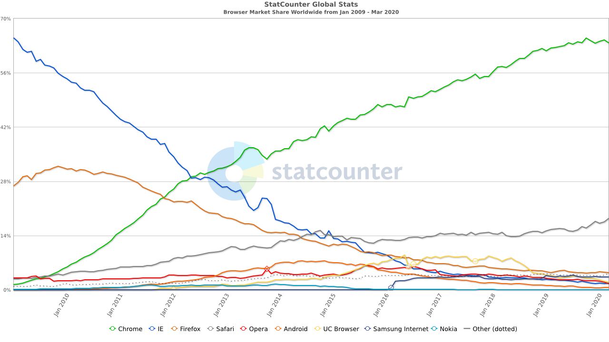

# HTML Basics

## Inhalt

* [Was ist HTML?](#was-ist-html)
* [Aufbau einer HTML-Datei](#aufbei-einer-html-datei)
* [Der Browser & Standards](#der-browser--standards)
* [IDs & Klassen](#ids--klassen)
* [Block- & Inline-Elemente](#block---inline-elemente)
* [Neue Elemente](#neue-elemente)

## Setup

Für Übungen nutzen wir die folgende **CodeSandbox** als Startpunkt:

**[https://codesandbox.io/s/rrcjw](https://codesandbox.io/s/rrcjw)**

Die Übungen bauen immer aufeinander auf. Aber keine Angst! Für den Fall, dass bei einer Übung etwas nicht klappen sollte, gibts bei jeder Übung einen Link zur CodeSandbox mit dem aktuellen Stand.

## Was ist HTML?

* «Hyper Text Markup Language»
* Auszeichnungssprache, keine Programmiersprache
* Zweck: Beschreiben von Inhalt
* Eigenheit: Presentation Semantics

### Eigenheiten einer HTML-Datei

* HTML benötigt keinen Server
* Dateien müssen mit `.html` enden
* Aufrufbar in jedem Webbrowser
* `index.html` ist der Root / die Startseite einer Website
  * http://www.something.com  
    &rightarrow; http://www.something.com/index.html  
    Die `index.html`-Datei wird automatisch angezeigt
  * http://www.something.com/about.html  
    &rightarrow; http://www.something.com/about.html  
    Hier verweisen wir explizit auf eine Seite
  * *Dieses Standardverhalten kann mit div. Servereinstellungen überschrieben werden.*

### Syntax

Offizielle Spezifikation: [https://www.w3.org/TR/2011/WD-html-markup-20110405/syntax.html#syntax-elements](https://www.w3.org/TR/2011/WD-html-markup-20110405/syntax.html#syntax-elements)

Elemente starten mit einem `<` gefolgt vom **Tagnamen**. Anschliessend kommen *optionale* **Attribute** und deren Values. Das Ende des Starttags ist mit einem `>` gekennzeichnet.  
Danach kommt der **Inhalt** des Elementes.  
Abschliessend kommt der Endtag, dieser startet wieder mit einem `<` gefolgt von einem `/` und dem **Tagnamen**, danach wird dieser geschlossen mit einem `>`

```html
<!-- Generelle Syntax -->
<tagname attribute="value">Inhalt</tagname>

<!-- Attribut ohne Wert -->
<tagname attribute>Inhalt</tagname>

<!-- Ohne Attribute -->
<tagname>Inhalt</tagname>
```

**Beispiele**

```html
<h1 id="my-id">Hallo Welt!</h1>
<p class="some-fany-class">Dies ist ein Paragraph</p>
```

#### Void Elemente

Es gibt auch sogenannte void elements. Diese haben keinen Inhalt und der Endtag ist daher implizit und muss nicht angegeben werden.

```html
<!-- Generelle Syntax -->
<tagname attribute="value">

<!-- Attribut ohne Wert -->
<tagname attribute>

<!-- Ohne Attribute -->
<tagname>

<!-- Mit zusätzlichem / -->
<tagname />
```

**Beispiele**

```html
<!-- Line Break <br> -->
<p>In diesem Satz gibt es<br>einen line break</p>

<!-- Image -->

```

Liste von void-elements: https://html.spec.whatwg.org/#void-elements

> **Das Wichtigste in Kürze**
>  
> * Elemente haben normalerweise einen Starttag, einen Inhalt und einen Endtag
> * Die Ausnahme sind sogenannte void-elements. Diese haben keinen Inhalt und daher auch keinen expliziten Endtag
> * Elemente können optional einen oder mehrere Attribute haben

## Aufbei einer HTML-Datei

HTML-Dateien haben einen gewissen Grundaufbau, damit der Browser genau weiss, was er machen muss.

```html
<!DOCTYPE html>
<html>
  <head>
    <title>Test</title>
  </head>
  <body>
    <h1 class=“fancy-title”>Hello World</h1>
    
    <p>
      Lorem ipsum dolor sit amet, consetetur.
    </p>
  </body>
</html>
```

* Der **Doctype** sagt dem Browser, welchen HTML-Standard dieser benutzen soll, um das Dokument anzuzeigen.
* `<html>` ist das Root-Element des Dokuments
* Im `<head>` stehen **Metainformationen**. Diese werden **nicht angezeigt**, sondern sind nur Informationen für Browser und Roboter, die diese auslesen.
* Im `<body>` seht der Inhalt der Page. Elemente innerhalb des Bodys werden dem User angezeigt.

### Infos zum `<html>`

Die Sprache der Website sollte auf dem `<html>`-Element angegeben werden, damit Roboter und Screenreader wissen, in welcher Sprache die Page angezeigt wird.

**Beispiel**

```html
<!DOCTYPE html>
<html lang="en">
  ...
</html> 
```

**Hilfreiche Links**

* [Documentation auf MDN](https://developer.mozilla.org/en-US/docs/Web/HTML/Element/html)

### Infos zum `<head>`

* Das `<titel>`-Element ist das Einzgie, welches required ist
* Der Head beinhaltet vor allem Metainformationen
* Darin befinden sich z.B. Verlinkungen von CSS-Dateien, JavaScript-Dateien oder auch Informationen für Roboter (Google, Facebook, Twitter usw.)

<details>
  <summary>Beispiel head von unic.com</summary>

```html
<head itemscope itemtype="http://schema.org/WebSite">
  <meta charset="utf-8" />
  <meta http-equiv="X-UA-Compatible" content="IE=Edge" />

  <title>Digitalagentur in Zürich, Bern, München und Karlsruhe – seit 1996 - Unic</title>

  <meta name="title" content="Digitalagentur in Zürich, Bern, München und Karlsruhe – seit 1996" />
  <meta itemprop="name" content="Digitalagentur in Zürich, Bern, München und Karlsruhe – seit 1996" />
  <meta name="twitter:title" content="Digitalagentur in Zürich, Bern, München und Karlsruhe – seit 1996" />
  <meta property="og:title" content="Digitalagentur in Zürich, Bern, München und Karlsruhe – seit 1996" />
  <meta name="keywords"
    content=" Digitale Erlebnisse, E-Business-Lösungen, E-Business, Unic, Digitall Marketing, Digital Commerce, E-Commerce, " />
  <meta name="description"
    content="Unsere 230 Expertinnen und Experten konzipieren, entwickeln und hosten für Sie Ihre digitale Plattform. Kontaktieren Sie uns für Ihr nächstes Webprojekt!" />
  <meta itemprop="description"
    content="Unsere 230 Expertinnen und Experten konzipieren, entwickeln und hosten für Sie Ihre digitale Plattform. Kontaktieren Sie uns für Ihr nächstes Webprojekt!" />
  <meta name="twitter:description"
    content="Unsere 230 Expertinnen und Experten konzipieren, entwickeln und hosten für Sie Ihre digitale Plattform. Kontaktieren Sie uns für Ihr nächstes Webprojekt!" />
  <meta property="og:description"
    content="Unsere 230 Expertinnen und Experten konzipieren, entwickeln und hosten für Sie Ihre digitale Plattform. Kontaktieren Sie uns für Ihr nächstes Webprojekt!" />
  <meta property="og:image"
    content="https://www.unic.com/-/media/corporate/unic/70-job-header/job-headers-2019/unic-data-analyst-hs6a9332.jpg?la=de&mw=1920&vs=1&hash=F96C3AE9495506CBA11F5D9EDB67253BBFE76572" />
  <meta property="twitter:image"
    content="https://www.unic.com/-/media/corporate/unic/70-job-header/job-headers-2019/unic-data-analyst-hs6a9332.jpg?la=de&mw=1920&vs=1&hash=F96C3AE9495506CBA11F5D9EDB67253BBFE76572" />
  <meta property="og:image:width" content="1920" />
  <meta property="og:image:height" content="1080" />
  <meta name="author" content="Unic" />
  <meta name="twitter:creator" content="Unic" />
  <meta name="robots" content="index follow" />
  <meta name="apple-mobile-web-app-capable" content="yes" />
  <meta name="apple-mobile-web-app-title" content="Unic">
  <meta name="application-name" content="Unic">
  <meta name="twitter:card" content="summary_large_image">
  <meta name="format-detection" content="telephone=no" />
  <meta name="viewport" content="width=device-width, initial-scale=1" />
  <link rel="apple-touch-icon" sizes="180x180" href="/apple-touch-icon.png">
  <link rel="icon" type="image/png" href="/favicon-32x32.png" sizes="32x32">
  <link rel="icon" type="image/png" href="/favicon-16x16.png" sizes="16x16">
  <link rel="manifest" href="/manifest.json">
  <link rel="mask-icon" href="/safari-pinned-tab.svg" color="#7b7d7d">
  <link rel="alternate" href="https://www.unic.com/de" hreflang="de" />
  <link rel="alternate" href="https://www.unic.com/en" hreflang="en" />
  <meta name="theme-color" content="#ffffff">

  <script>
    window.unicSite = {
      basePath: '/assets/',
      utagSrc: '//tags.tiqcdn.com/utag/unic/r16/prod/utag.js',
    };
  </script>

  <script>
    (function (docElem) {
      //polyfills
      if (!Object.assign || !docElem.closest || !String.prototype.includes || !window.cancelAnimationFrame || !Array
        .from || !Array.prototype.find || !window.HTMLPictureElement || !('objectFit' in docElem.style)) {
        document.write('<script src="/assets/js/polyfills.min.js"><\/script>');
      }
    })(document.documentElement);
  </script>

  <script>
    ! function (n) {
      "use strict";
      var o = n.document,
        t = o.documentElement;
      t.classList.remove("no-js"), t.classList.add("js"), o.fonts && o.fonts.forEach && ! function (n) {
        o.fonts.forEach(function (o) {
          n.push(o)
        }), setTimeout(function () {
          n.forEach(function (n) {
            n.load()
          })
        }, 0)
      }([])
    }(window);

  </script>

  <link href="/assets/css/main.min.css?v=86b071d049b5000bdae4065f33a3c518" rel="stylesheet" />
  <script src="/assets/js/crucial.min.js?v=86b071d049b5000bdae4065f33a3c518"></script>

  <script type="text/javascript">
    var SC_RumID = 5467;
  </script>
  <script type="text/javascript" async src="https://www.statuscake.com/App/RUM/embed.js"></script>

  <style>
    @font-face {
      font-family: "Publico Headline Web";
      src: url("/assets/fonts/publicoHeadline-bold-web.woff2") format("woff2"), url("/assets/fonts/publicoHeadline-bold-web.woff") format("woff");
      font-style: normal;
      font-stretch: normal;
      font-weight: 700;
    }

    @font-face {
      font-family: "Publico Headline Web";
      src: url("/assets/fonts/publicoHeadline-italic-web.woff2") format("woff2"), url("/assets/fonts/publicoHeadline-italic-web.woff") format("woff");
      font-style: italic;
      font-stretch: normal;
      font-weight: 400;
    }

    @font-face {
      font-family: "Benton Sans Reg";
      src: url("/assets/fonts/benton-sans-regular.woff") format("woff");
      font-style: normal;
      font-weight: normal;
    }

    @font-face {
      font-family: "Benton Sans Reg";
      src: url("/assets/fonts/benton-sans-italic.woff") format("woff");
      font-style: italic;
      font-weight: normal;
    }

    @font-face {
      font-family: "Benton Sans Reg";
      src: url("/assets/fonts/benton-sans-medium.woff") format("woff");
      font-style: normal;
      font-weight: 600;
    }
  </style>
</head>
```
</details>

Folgendes sollte im `<head>`als **minimum** drin sein (abgesehen vom mandatory `<title>`):

```html
<head>
  <!-- Stellt sicher, dass das richtige Charset verwendet wird -->
  <meta charset="utf-8" />
  <!-- Wird nur genutzt, falls ältere IE-Versionen unterstützt werden sollten -->
  <meta http-equiv="X-UA-Compatible" content="IE=Edge" />
</head>
```

**Hilfreiche Links**

* [Documentation auf MDN](https://developer.mozilla.org/en-US/docs/Web/HTML/Element/head)
* [Practical Guide](https://htmlhead.dev/)

> **Das Wichtigste in Kürze**
>  
> * Ein HTML-Dokument beinhaltet einen Doctype, das `<html>`-Element und darin den `<head>` und den `<body>`
> * Im `<head>` ist das `<title>`-Element required, ansonsten stehen im Head vor allem Metainformationen
> * Im `<body>` ist der Inhalt der Page angegeben, welche der User sehen kann

### Practice 🔥

Öffne diese [**CodeSandbox**](https://codesandbox.io/s/rrcjw) als Startpunkt.

- [ ] Füge ein HTML-Grundgerüst ein
- [ ] Wir bilden ein kleine Todo App. Du kannst einen passenden `<title>` einfügen

Zeit: ~ 5 min

**Solution**: [https://codesandbox.io/s/eemf9](https://codesandbox.io/s/eemf9)

## Der Browser & Standards

> Standards... how boring 🥱

Der Browser rendert das ganze HTML, es ist best Friend und gleichzeitig der Endgegner aller Frontendler.  
Dabei gibt es nicht nur Edge und Chrome, sondern noch andere. Jeder Browserhersteller (Browservendor) hat natürlich seine eigenen Auffassungen, wie er was am besten umsetzen kann. Damit aber unsere Page gleich aussieht im Chrome, sowie im Safari, werden **Standards** benötigt.

Die aktuelle Browserlandschaft der meistbenutzten Browser sieht so aus:

**Desktop**

* Chrome
* Firefox
* Safari (Exklusiv für macOS)
* Edge
* IE11 (Exklusiv für Windows)
* Opera
* UC Browser

**Mobile**

* Android
  * Chrome
  * Samsung Internet
* iOS
  * Safari

> **Note:** Dies ist keine vollständige Liste, sondern beinhaltet nur die meist genutzten Browser

<details>
  <summary>Browserentwicklung der letzten 10 Jahre</summary>

**1996 - 2009**

Source: [https://en.wikipedia.org/wiki/Usage_share_of_web_browsers](https://en.wikipedia.org/wiki/Usage_share_of_web_browsers)

**2009 - 2020**

Source: [https://gs.statcounter.com/browser-market-share#monthly-200901-202003](https://gs.statcounter.com/browser-market-share#monthly-200901-202003)
</details>

### HTML(5(.3)): Aktueller Standard

[W3C](https://www.w3.org/) als offizielle Organisation zur Standardisierung.

> **Quote**
>  
> Leading the web to its full potential

[WHATWG](https://whatwg.org/) ist eine Vereinigung von Browservendors wie Google, Apple, Mozilla und Opera mit einer eigenen Spezifikation.
Die W3C übernimmt die Spezifikation der WHATWG grösstenteils in die offizielle Spezifikation.

**Geschichte**

* Einführung der HTML5-Spezifikation als «W3C Recommendation» im Oktober 2014
* Version "HTML 5.1" seit Oktober 2017 im Status «W3C Recommendation»
  * Beispiel von Neuerungen: picture-Element und srcset-Attribute
* Version "HTML 5.2" seit Dezember 2017 im Status «W3C Recommendation»
  * Beispiel von Neuerungen: dialog-Element
* Aktuelle Weiterentwicklung im «HTML 5.3 Working Draft»
  * Snapshot des [Living Standards](https://html.spec.whatwg.org/multipage/) der WHATWG

**Hilfreiche Links**

* W3C:
  * 5: http://www.w3.org/TR/html5/
  * 5.1: http://www.w3.org/TR/html51/
  * 5.2: http://www.w3.org/TR/html52/
  * 5.3: http://www.w3.org/TR/html53/
  * https://github.com/w3c/html/ (obsolete)
* WHATWG
  * https://html.spec.whatwg.org/
  * https://github.com/whatwg/html

### Testing einer Website

Da Browser alle ein bisschen anders funktionieren, oder zum Teil gar sehr alt sind aber trotzdem noch benutzt werden (z.B. IE11), müssen unsere Kreationen auch ausgiebig getestet werden.

**Nativ**

Beim nativen testen, wird die zu testende Page auf 'echten' Geräten aufgerufen und manuell getestet.

**Virtualisiert** _(nicht empfohlen, veraltet)_

VM für verschiedene IE-Versionen: https://developer.microsoft.com/en-us/microsoft-edge/tools/vms/

**Remote** _(nativ und virtualisiert)_

Externe Dienste, um deine Page auf verschiedensten Geräten zu testen

* [Browserstack (empfohlen)](https://www.browserstack.com/)
* [Sourcelabs](https://saucelabs.com/)

> **Note:** Bevor ihr ein Projekt startet, überlegt euch gut, welche Browser unterstützt werden sollten. Einen älteren Browser im Nachhinein zu unterstützen ist meist mit sehr grossem Aufwand verbunden.

## IDs & Klassen

IDs und Klassen können auf jedes HTML-Element gesetzt werden. Sie dienen zur Identifikation und dem Styling von Elementen.

### IDs

* Können auf jedes Element mit dem id-Attribut gesetzt werden, sind aber überall optional
* Werden zur Identifikation von Elementen benutzt (z.B. um ein bestimmtes Element im JavaScript anzusteuern, oder um es mit CSS zu stylen)
* Dürfen jeweils nur einmal in einen HTML-Dokument vorkommen

**Beispiel**

```html
<div id="container">
  <h1 id="page-title">Headline<h1>
  ...
</div>
```

### Klassen

* Können auf jedem Element mit dem class-Attribut gesetzt werden, sind aber überall optional
* Klassen werden fürs Styling bevorzugt
* Es können mehrere Klassen auf ein Element angewandt werden, diese sind mit einem Leerzeichen zu trennen

**Beispiel**

```html
<div class="container">
  <h1 class="headline-primary second-class">
    Headline
  <h1>
  ...
</div>
```

## Block- & Inline-Elemente

HTML-Elemente unterscheiden sich grundsätzlich in zwei Typen: in Block- und Inline-Elemente.

### Block-Element

* Block-Elemente nehmen immer die volle Breite des Elternelementes ein
* Aufeinanderfolgende Block-Elemente werden daher per default untereinander dargestellt

**Beispiel**

```html
<p style="border: 2px solid green">
  Lorem ipsum dolor sit amet 
  consectetur adipisicing elit. 
  Aut earum dolor perferendis 
  ducimus vitae soluta. 
</p> 
<p style="border: 2px solid green">
  Lorem ipsum dolor sit amet 
  consectetur adipisicing elit. 
  Aut earum dolor perferendis 
  ducimus vitae soluta.
</p>
```

**Demo** 🤯 

- [Block-Elemente](https://codesandbox.io/s/mywz6)

### Inline Element

* Inline-Elemente besetzen nur den Platz, der benötigt wird
* Aufeinanderfolgende Inline-Elemente werden daher nebeneinander dargestellt

```html
<p>
  <a href="#" style="border: 2px solid blue">
    Link A
  </a>
  <a href="#" style="border: 2px solid blue">
    Link B
  </a>
</p>
```

**Demo** 🤯 

- [Inline-Elemente](https://codesandbox.io/s/k63zy)

### Weitere Infos

* Das Verhalten von Elementen kann über die display Property mit CSS überschrieben werden (mehr dazu später)
* Eine Übersicht von Block- & Inline-Elementen unter https://www.w3schools.com/html/html_blocks.asp

### Practice 🔥

Öffne diese [**CodeSandbox**](https://codesandbox.io/s/eemf9) als Startpunkt.

- [ ] Erstelle als erstes eine zweite Seite `about.html`
- [ ] Füge auf der `index.html` einen Link ein auf `about.html`
- [ ] Füge nun auf der `about.html` einen Link ein, sodass man wieder zur Startseite kommt
- [ ] Füge bei beiden Seiten einen `<h1>` mit einem passenden Titel ein
- [ ] Schreibe auf der `about.html` einen kurzen Paragraphen über Dich selbst und füge ein Bild ein.  
  Du kannst dafür das vorhandene `avatar.jpg` nutzen oder selbst ein Bild per Drag & Drop hochladen und dieses einbinden
- [ ] Füge auf beiden Seiten einen Fussbereich ein, wo Du dein &copy; platzieren kannst
- [ ] Passe deine Navigation so an, dass auf jeder Seite alle Navigationslinks vorhanden sind. Zeige die Navigationspunkt als Liste `<ul>` an

  Hilfestellung und Spezifikation der benutzten Tags unter https://www.w3schools.com/html/html_blocks.asp

Zeit: ~ 20 min

**Solution:** [https://codesandbox.io/s/2spun](https://codesandbox.io/s/2spun)

### Infos zu den benutzten Elementen

<details>
  <summary>Headings und Paragraphen</summary>

* Headings und Paragraphen sind beides Blockelemente
* Es gibt sechs Headings, `<h1>` bis `<h6>`
* Headings beinhalten semantische Informationen, ein `<h2>` sollte daher zum Beispiel immer unterhalb eines `<h1>` stehen. Zudem sollte es keine Lücken haben, einen `<h3>` nach einem `<h1>` zu verwenden ist also nicht erlaubt.
* Paragraphen `<p>` werden vor allem für Fliesstext gebraucht
* Innerhalb von Paragraphen dürfen nur Inlineelemente benutzt werden
</details>

<details>
  <summary>Links</summary>

* Können ein relatives Ziel zur aktuellen HTML-Datei, oder eine absolute URL haben
* Die Zielurl wird im `href`-Attribut angegeben
* Der `target`-Attribut bietet die Möglichkeit das Linkziel in einem neuen Browsertab zu öffnen

**Beispiel**

```html
<!-- Relatives Ziel -->
<a href="./about.html">About us</a>

<!-- Absolute URL als Ziel -->
<a href="/contact.html">Contact</a>

<!-- Externes Ziel -->
<a href=https://www.ost.ch target="_blank" rel="noopener">OST</a>
```
</details>

<details>
  <summary>Bilder</summary>

* Bilder haben zwei Attribute welche benötigt werden `src` und `alt`
* Der `src`-Attribut beinhaltet den Pfad zur anzuzeigenden Bilddatei. Diese kann sowohl relativ (vom HTML-Dokument aus), oder mit einem absoluten Pfad referenziert werden (z.B. https://www.ost.ch/someimage.jpg)
* Der `alt`-Attribut wird dem User gezeigt, wenn das Bild nicht geladen werden kann. Dieser dient ebenfalls als Informationen für Suchmaschinen und Screenreader

**Beispiel**

```html
<!-- Bild relativ zur HTML-Datei -->


<!-- Absoluter Pfad -->


<!-- Externes Bild -->


<!-- Breite und Höhe kann gesetzt werden -->

```
</details>

<details>
  <summary>Listen</summary>

* Es gibt ungeordnete Listen `<ul>` (am häufigsten verwendet) und geordnete Listen `<ol>`
* Die einzelnen Listeneinträge sind in beiden Fällen `<li>`
* `<li>` sind die einzigen Elemente, die direkt innerhalb von `<ul>` oder `<ol>` benutzt werden dürfen
* Navigationen sind fast immer mit `<ul>` erstellt, da diese von Suchmaschinen und Screenreaders gut erkannt werden.

**Beispiel**

```html
<ul>
  <li>Eintrag 1</li>
  <li>Eintrag 2</li>
  <li>Eintrag 3</li>
  <li>
    Eintrag 4
    <ul>
      <li>Eintrag 4.1</li>
      <li>Eintrag 4.2</li>
    </ul>
  </li>
</ul>

<ol>
  <li>Eintrag 1</li>
  <li>Eintrag 2</li>
  <li>Eintrag 3</li>
</ol>
```
</details>

<details>
  <summary>Divs</summary>

* Divs sind Block-Elemente welche *keine* semantischen Informationen beinhalten
* Werden vor allem für das Strukturieren von Inhalt benutzt

**Beispiel**

```html
<div>
  <div>
    <!-- Header -->
    <div>
      <!-- Navigation -->
    </div>
  </div>
  <div>
    <!-- Content -->
  </div>
  <div>
    <!-- Footer -->
  </div>
</div>
```
</details>

## Neue Elemente

HTML5 bietet viele neue Elemente, die den Browser vor allem mit semantischen Informationen füttern. Dies ist speziell gut für Suchmaschinen und um eine bessere Accessibility zu erzielen.

Zu den meistbenutzen Elementen gehören:

* `<header>`
* `<footer>`
* `<nav>`
* `<main>`
* `<section>`
* `<article>`
* `<aside>`

Beschreibungen der Elemente unter: [https://developer.mozilla.org/en-US/docs/Web/HTML/Element#Content_sectioning](https://developer.mozilla.org/en-US/docs/Web/HTML/Element#Content_sectioning)

### Practice 🔥

Öffne diese [**CodeSandbox**](https://codesandbox.io/s/2spun) als Startpunkt.

- [ ] Strukturiere die Seite mit den neuen HTML5-Elementen
  - [ ] Nutze mindestens 4 der oben gelisteten Elemente
  - [ ] Strukturiere Deine Page so, wie es für Dich am meisten Sinn ergibt

  Tipp: Du kannst Dir auch den Quellcode einer beliebigen Page anschauen und dort die Struktur analysieren  
  Hilfestellung und Beschreibungen zu den Elementen unter: https://developer.mozilla.org/en-US/docs/Web/HTML/Element#Content_sectioning

Zeit: ~ 5 min

**Solution:** [https://codesandbox.io/s/f01xs](https://codesandbox.io/s/f01xs)
