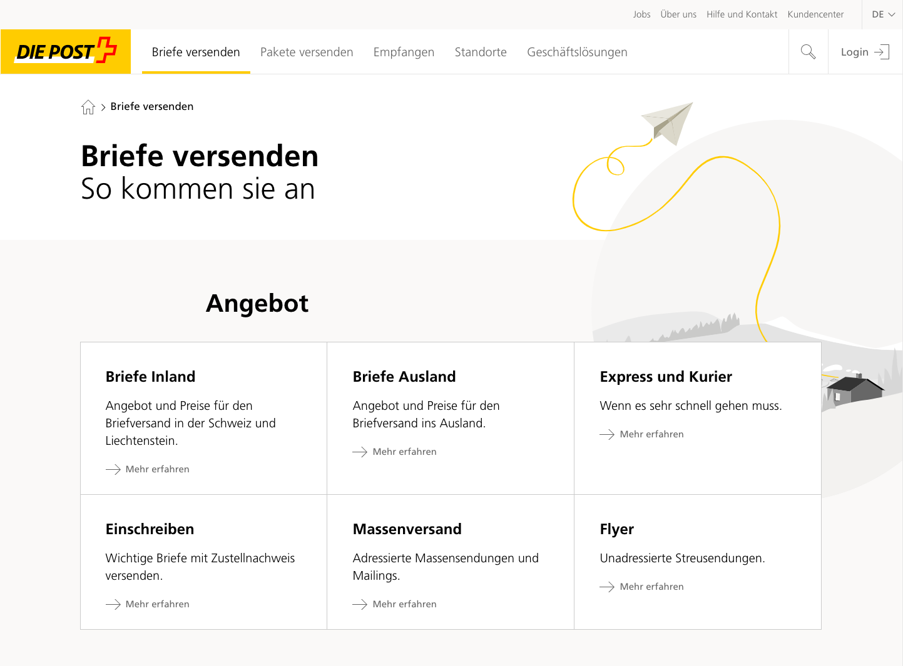
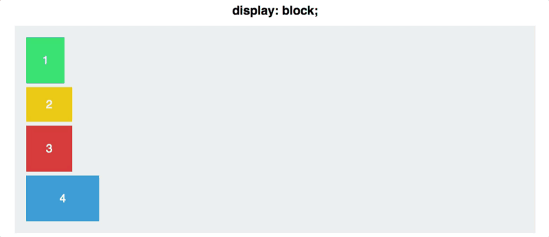
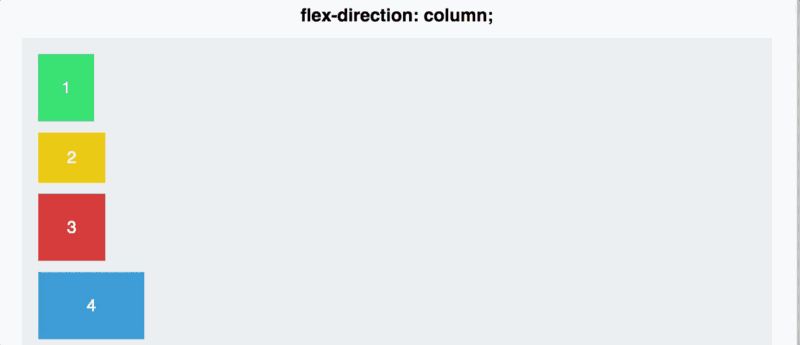
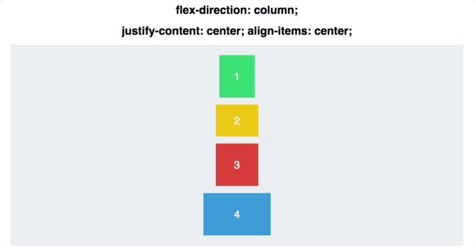
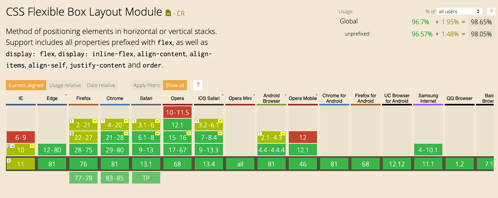
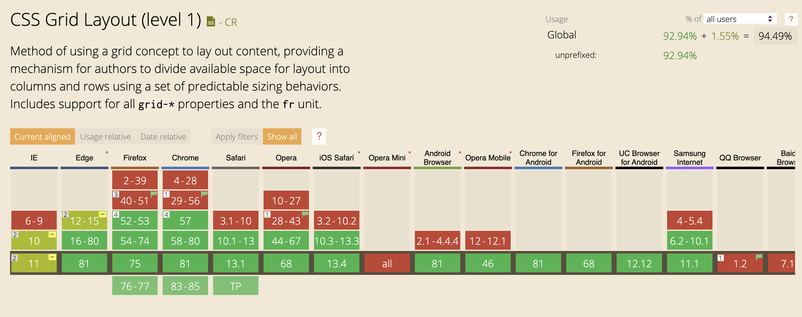
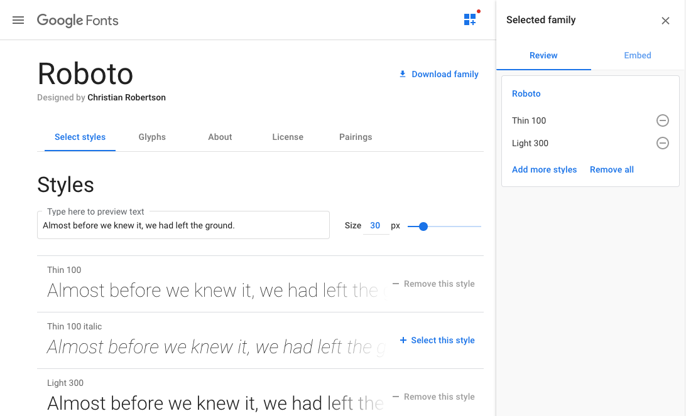
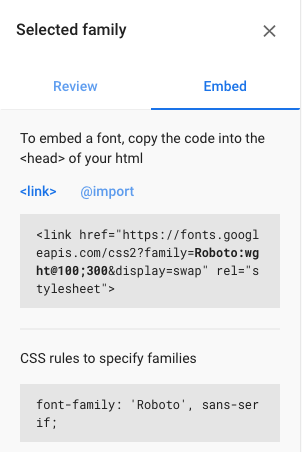
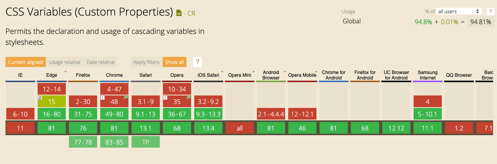

# CSS Fortgeschrittene Grundlagen

## Inhalt

* [Quick-Recap](#quick-recap)
* [Flexbox & CSS Grid](#flexbox--css-grid)
* [Webfonts](#webfonts)
* [CSS Variablen](#css-variablen)
* [Motion, Transitions & Animations](#motion-transitions--animations)

## Setup

Für Übungen nutzen wir die folgende **CodeSandbox** als Startpunkt:

**[https://codesandbox.io/s/bnydy](https://codesandbox.io/s/bnydy)**

Die Übungen bauen immer aufeinander auf. Aber keine Angst! Für den Fall, dass bei einer Übung etwas nicht klappt, gibts bei jeder Übung einen Link zur CodeSandbox mit dem aktuellen Stand.

## Quick Recap

* [Was ist CSS?](../00_HTML_CSS_Vorkurs/was-ist-css.md#was-ist-css)
* [Implementation von CSS](../00_HTML_CSS_Vorkurs/was-ist-css.md#implementation-von-css)
* [CSS Selektoren](../00_HTML_CSS_Vorkurs/was-ist-css.md#css-selektoren)
* [CSS Einheiten](../00_HTML_CSS_Vorkurs/was-ist-css.md#css-einheiten)
* [Die Kaskade](../00_HTML_CSS_Vorkurs/was-ist-css.md#die-kaskade)
* [Farben](../00_HTML_CSS_Vorkurs/was-ist-css.md#farben)
* [Box-Model, Margins und Paddings](../00_HTML_CSS_Vorkurs/was-ist-css.md#box-model-margins-und-paddings)

## Flexbox & CSS Grid

Bei einem normalen Layout mit Block-Elementen sind alle Elemente untereinander, da Block-Elemente immer 100% der verfügbaren Breite einnehmen. Dies ist natürlich nicht immer gewünscht. Damit wir Block-Elemente nebeneinander darstellen können oder wenn wir das Verhalten von Inline-Elementen anpassen möchten, gibts Flexbox (`display: flex;`) und CSS Grid (`display: grid;`).  



### Flexbox

* Flexbox kann mit der CSS-Deklaration `display: flex;` genutzt werden
* `display: flex;` wird auf einem gemeinsamen Eltern-Element gesetzt
* Dieses Eltern-Element wird dann auch der **Flex-Container** genannt
* Kinder-Elemente erhalten dadurch einen Flex-Context und werden nun per default als Inline-Elemente nebeneinander dargestellt

**Beispiele**

```css
.container {
  display: flex;
}
```

```html
<div class="container">
  <div>1</div>
  <div>2</div>
  <div>3</div>
  <div>4</div>
</div>
```



**Demo** 🤯

- [Flexbox Basic](https://codesandbox.io/s/utxor)

#### Flex Axis

* Ein Flex-Container hat eine **Main Axis** und eine **Cross Axis**
* Per Default verläuft die Richtung der Kinder-Elemente horizontal von links nach rechts (`flex-direction: row;`)


#### Flex Direction

* `flex-direction` ermöglicht den Richtungswechsel der **Main Axis**
* Kann nur auf einem **Flex-Container** gesetzt werden
* Mögliche Werte:
  * `row`
  * `column`
  * `row-reverse`
  * `column-reverse`

**Beispiele**

```css
.container {
  display: flex;
  flex-direction: column;
}
```


Mit `row-reverse` und `column-reverse` kann Richtung/Flow umgekehrt werden.

**Beispiele**

```css
.container {
  display: flex;

  /* right to left */
  flex-direction: row-reverse;

  /* bottom to top */
  flex-direction: column-reverse;
}
```



**Demo** 🤯

- [Flexbox Direction](https://codesandbox.io/s/9pvry)

#### Justify Content

* `justify-content` deklariert die Position auf der **Main Axis**
* Mögliche Werte:
  * `flex-start`
  * `flex-end`
  * `center`
  * `space-between`
  * `space-around`

**Beispiele**

```css
.container {
  display: flex;
  justify-content: flex-start;
}
```


**Demo** 🤯

- [Flexbox Justify Content](https://codesandbox.io/s/2j6kb)

#### Align Items

* `align-items` deklariert die Position auf der **Cross Axis**
* Mögliche Werte:
  * `flex-start`
  * `flex-end`
  * `center`
  * `stretch`
  * `baseline`

**Beispiele**

```css
.container {
  display: flex;
  align-items: center;
}
```


**Demo** 🤯

- [Flexbox Align Items](https://codesandbox.io/s/1niib)

#### Demo

Hier eine kleine Demo wie die Properties zusammen funktionieren.



#### Flex

* Die `flex`-Property ist ein Shorthand für `flex-grow`, `flex-shrink` und `flex-basis`
* `flex-basis` definiert, wie gross das Element per default sein kann (%-Wert der Main Axis)
* `flex-grow` definiert, ob und in welcher Relation das Element grösser sein kann als die flex-basis
* `flex-shrink` definiert, ob und in welcher Relation das Element kleiner sein kann als die flex-basis
* Alle diese Properties können **nur** auf **direkten** Kinder-Elementen eines Flex-Container gesetzt werden

**Beispiele**

```css
.container {
  display: flex;
}

.children {
  flex-grow: 0;
  flex-shrink: 1;
  flex-basis: 100%;

  /* Shorthand */
  flex: 0 1 100%;
}
```

**Demo** 🤯

- [Flexbox Flex](https://codesandbox.io/s/7y69r)

**Caveats**

* Im IE11 werden zu der `flex-basis` immer noch die Paddings dazu gerechnet  
  &rightarrow; Um dies zu umgehen, kann noch eine `max-width` auf dem Element platziert werden, mit dem gleichen Wert der `flex-basis`

#### Browser Support

* Bei IE11 muss bei `flex-direction: column;` aufgepasst werden. Dort kann es zu Bugs kommen, wenn man mit `flex-grow`, `flex-shrink` und einer `flex-basis`, welche nicht `auto` ist, arbeiten will.



[Caniuse - Flexbox](https://caniuse.com/#search=css%20flexbox)

**Hilfreiche Links**

* [CSS Tricks Artikel](https://css-tricks.com/snippets/css/a-guide-to-flexbox/)
* [Spielerisch lernen](https://flexboxfroggy.com/)
* [Freecodecamp Artikel](https://medium.freecodecamp.org/an-animated-guide-to-flexbox-d280cf6afc35)
* [MDN](https://developer.mozilla.org/en-US/docs/Web/CSS/CSS_Flexible_Box_Layout)

### CSS Grid

Mit `display: grid;` kann CSS Grid eingesetzt werden. Ein Grid ist wie eine *Tabelle*, wobei die einzelnen Kinder-Elemente frei in dieser *Tabelle* plaziert werden können.

Das Element, welches auf dem `display: grid;` deklariert wird, wird dadurch zum **Grid-Container** und die direkten Kinder-Elemente erhalten einen Grid-Context (wie auch bei Flexbox).

Vorteile:
* Mit CSS Grid kann praktisch jedes erdenkliche Layout erstellt werden, da Elemente *frei* vom content Flow platziert werden können.

Nachteile:
* Komplexe Syntax
* IE11 Support ist nicht vollständig

Da dieses Thema sehr gross ist, sind in diesem Script **nur** die Basics zu finden.  
Für mehr Informationen, bitte die folgenden hilfreichen Links beachten.

#### Template Columns

Mit `grid-template-columns` können wir deklarieren, wieviele Spalten unser Grid hat und wie breit diese sein sollen. Mögliche Angaben sind nicht nur alle normalen Weitenangaben wie `px`, `%`, `auto`, etc., sondern auch eine neue Breitenangabe `fr` &rightarrow; Fraction. Es gibt aber auch spezielle Funktionen wie `minmax()` und `repeat()`.

```css
.container {
  display: grid;
  grid-template-columns: 1fr 1fr auto 20%;
  grid-column-gap: 4px;
}
```

**Demo** 🤯

- [Template Columns](https://codesandbox.io/s/gpk5i)

#### Template Rows

Mit `grid-template-rows` können wir die Höhen der Rows steuern. Dies funktioniert grundsätzlich gleich wie `grid-template-columns`, einfach für die vertikale Achse.

```css
.container {
  display: grid;
  grid-template-columns: 1fr 1fr auto 20%;
  grid-column-gap: 4px;
  height: 200px;
  grid-template-rows: 30% 70%;
  grid-row-gap: 4px;
}
```

**Demo** 🤯

- [Template Rows](https://codesandbox.io/s/jhwej)

#### Row / Column Start und Ende

* Bestimmt, wo ein Grid-Child beginnt und endet (column & row)
* Die Position des Grid-Child ist unabhängig von der Reihenfolge im HTML

```css
.container {
  /* ... */
}

.first {
  grid-column-start: 2;
  grid-column-end: 4;
  /* Shorthand */
  grid-column: 2 / span 2;

  grid-row-start: 1;
  grid-row-end: 3;
  /* Shorthand */
  grid-row: 1 / span 2;
}
```

**Demo** 🤯

- [Row / Column Start und Ende](https://codesandbox.io/s/krbik)

#### Justify / Align

* Positionierungs-Attribute sind wie bei Flexbox anwendbar
* Positioniert die Grid-Child-Elemente innerhalb des Grid, nicht den Grid-Container selbst
* Die Positionierung ist innerhalb der zugeteilten Column & Row

```css
.container {
  /* Grid-Child-Elemente werden zentriert */
  justify-items: center;
  align-items: center;

  /* Grid-Child-Elemente werden links unten angezeigt */
  justify-items: start;
  align-items: end;
}
```

**Demo** 🤯

- [Justify / Align](https://codesandbox.io/s/pj52s)

#### Grid Areas

* Eine übersichtliche Alternative zu einzelnen `grid-column`/`grid-row` Deklarationen
* Grid Areas werden auf dem Grid-Container deklariert
* Grid-Child-Elemente können anschliessend die `grid-area`-Property nutzen

```css
.container {
  height: 250px;
  display: grid;
  grid-template-columns: 1fr auto;
  grid-template-rows: auto 1fr auto;
  grid-template-areas:
    "header header"
    "content sidebar"
    "footer footer";
}

.header { grid-area: header; }
.content { grid-area: content; }
.sidebar { grid-area: sidebar; }
.footer { grid-area: footer; }
```

**Demo** 🤯

- [Grid Areas](https://codesandbox.io/s/v5dd4)

#### Browser Support



[Caniuse - CSS Grid](https://caniuse.com/#search=css%20grid)

**Caveats**

* Im IE11 wird nur eine ältere [Spezifikation](https://www.w3.org/TR/2011/WD-css3-grid-layout-20110407/) von CSS Grid unterstützt
  * Unter anderem werden `grid-template-areas` nicht unterstützt

**Hilfreiche Links**

* [CSS Tricks Artikel](https://css-tricks.com/snippets/css/complete-guide-grid/)
* [Spielerisch lernen](https://cssgridgarden.com/)
* [Cheatsheet](http://grid.malven.co/)
* [MDN](https://developer.mozilla.org/en-US/docs/Web/CSS/CSS_Grid_Layout)

### Practice 🔥

Öffne diese [**CodeSandbox**](https://codesandbox.io/s/bnydy) als Startpunkt.

- [ ] Verwende **flexbox** oder **CSS Grid** um deine vorhandene ToDo-App zu strukturieren
  - [ ] Füge zur rechten Seite vom `<main>`-Element noch eine Sidebar (`<aside>`) ein, um einen kurzen Text darzustellen
  - [ ] Strukturiere das Formular so, dass es für die User besser bedienbar ist.

Zeit: ~ 15 min

**Solution Flexbox**: [https://codesandbox.io/s/2eylr](https://codesandbox.io/s/2eylr)  
**Solution CSS Grid**: [https://codesandbox.io/s/pyxnf](https://codesandbox.io/s/pyxnf)

## Webfonts

Heutzutage, kann jede beliebige **Custom-Font** im Web genutzt werden.  
Dazu gibt es verschiedene Implementierungsmöglichkeiten:

* CSS
  * `@font-face`: Schriftdateien werden im eigenen CSS referenziert
  * `@import`: Externe CSS-Datei wird im eigenen CSS referenziert (nicht empfohlen)
  * `<link>`: Externe CSS-Datei wird im `<head>` referenziert (am einfachsten zu nutzen)
* JavaScript
  * `FontFace` Web API

Custom Fonts werden unter anderem von den folgenden Anbietern geliefert:

* [https://fonts.google.com/](https://fonts.google.com/)
* [https://fonts.adobe.com/typekit](https://fonts.adobe.com/typekit)
* [https://www.fonts.com/](https://www.fonts.com/)
* ...

Sobald die Schriften referenziert sind, können diese per `font-family: <font-name>;` verwendet werden.

### CSS

#### Lokale Font

Per `@font-face` können eigene Schriftdateien als Custom Fonts deklariert werden.
Sobald der Browser den ersten Text rendert, wo diese Font genutzt wird, lädt er diese herunter und wendet sie an.

```css
@font-face {
  font-family: "MyWebFont";
  src: url("http://fonts.gstatic.com/path/to/my/font.woff2") format('woff2');
}

body {
  font-family: "MyWebFont", serif;
}
```

Nicht alle Browser funktionieren gleich. Damit wir eine Deklaration haben, welche von allen aktuellen Browsern unterstützt wird, müssen wir verschiedene Schriftformate angeben.

```css
@font-face {
  font-family: 'MyWebFont';
  src: url('./path/webfont.woff2') format('woff2'), /* Current browser versions */
       url('./path/webfont.woff') format('woff'); /* IE 9+, Safari 5.1-9.1, iOS 5.1-9.3, Android 4.4 */
}

body {
  font-family: "MyWebFont", serif;
}
```

Im Web werden meist auch verschiedene Schrift-Schnitte der gleichen Schrift verwendet (z.B. verschiedene Schriftdicken oder italic). Diese kann man auch unter der gleichen `font-family` registrieren.

```css
@font-face {
  font-family: 'MyWebFont';
  font-weight: 400;
  src: url('./path/normal.woff2') format('woff2'),
       url('./path/normal.woff') format('woff');
}

@font-face {
  font-family: 'MyWebFont';
  font-weight: 700;
  src: url('./path/bold.woff2') format('woff2'),
       url('./path/bold.woff') format('woff');
}

@font-face {
  font-family: 'MyWebFont';
  font-weight: 700;
  font-style: italic;
  src: url('./path/bold-italic.woff2') format('woff2'),
       url('./path/bold-italic.woff') format('woff');
}

body {
  font-family: "MyWebFont", serif;
  font-weight: 400;
}

/* Bold */
h1 {
  font-weight: 700;
}

/* Bold & Italic */
h2 {
  font-weight: 700;
  font-style: italic;
}
```

**Demo** 🤯

- [Lokale Custom Fonts](https://codesandbox.io/s/jjnhv)
- [Lokale Custom Fonts mit mehreren Schrift-Schnitten](https://codesandbox.io/s/3h57k)

#### Externe Font (Beispiel fonts.google.com)

Auf [fonts.google.com](https://fonts.google.com/) können beliebige Schriften ausgewählt und importiert werden.  
Einfach die Schriften auswählen und anschliessend einbetten. Die Schriften können aber auch heruntergeladen werden und dann als lokale Schriften eingebunden werden.

**fonts.google.com**



**Einbetten/Embedding**

Die Schriften können entweder per `<link>` oder per `@import` eingebettet werden.



**Demo** 🤯

- [Externe Custom-Fonts](https://codesandbox.io/s/ytf7w)

### JavaScript

#### FontFace Web API

Mit der FontFace API gibt es auch die Möglichkeit, Custom Fonts per JavaScipt zu laden.  
Wie die Schrift angewendet werden kann, bleibt genau gleich (per `font-family` CSS-Deklaration)

```javascript
const fontFace = new FontFace('MyWebFont', 'url("xy.woff2") format("woff2"), url("xy.woff") format("woff")');

fontFace.load().then(function(loadedFontFace) {
  document.fonts.add(loadedFontFace); // Font wird hinzugefügt
  document.documentElement.classList.add('font-loaded');
});
```

```css
body {
  font-family: Arial, sans-serif;
}

.font-loaded body {
  font-family: 'MyWebFont', sans-serif;
}
```

**Demo** 🤯

- [Custom Fonts per JavaScript](https://codesandbox.io/s/rdz2p)

**Hilfreiche Links**

* [Smashing Magazine](https://www.smashingmagazine.com/2018/07/smashingconf-videos-web-fonts-performance/)
* [Custom Fonts - Loading Strategies](https://www.zachleat.com/web/comprehensive-webfonts/)
* [Google Fonts herunterladen](https://google-webfonts-helper.herokuapp.com/)

### Practice 🔥

Öffne diese [**CodeSandbox**](https://codesandbox.io/s/2eylr) als Startpunkt.

- [ ] Füge deiner ToDo-App eine Custom Font hinzu, nutze dafür Google Fonts

Zeit: ~ 5 min

**Solution**: [https://codesandbox.io/s/i3nb9](https://codesandbox.io/s/i3nb9)

> **Das Wichtigste in Kürze**
>  
> * Custom Fonts werden in allen aktuellen Browsern unterstützt (sogar im IE11)
> * Es gibt verschiedene Möglichkeiten diese hinzuzufügen, lokale Schriften sind immer zu bevorzugen
> * ACHTUNG: Wenn der Browser die Schriften anwendet, verursacht dies ein Repaint/Reflow der Website

## CSS Variablen

Mit CSS Variablen kann eine Variable definiert und anschliessend mehrmals genutzt werden.  
Damit können Redundanzen im CSS verhindert werden.

**CSS Variables** werden auch **Custom Properties** genannt.

### Syntax

**Variablen definieren**

```css
:root {
   --variable-name: <value>;
}
```

**Variablen nutzen**

```css
.my-awesome-class {
  property: var(--variable-name);
}
```

### Scope

Variablen können im Root definiert werden, somit sind diese global verfügbar.  
Sie können aber auch innerhalb eines Selektors definiert werden, dadurch erhält die Variable auch nur innerhalb des Selektors den vergebenen Wert.

**Beispiele**

```css
/* CSS */
:root {
   --default-padding: 10px;
}

.card {
   --default-padding: 20px;
}

p {
  padding: var(--default-padding);
}
```

```html
<p>This paragraph is padded by <b>10px</b> on each side.</p>

<div class="card">
  <p>This paragraph is padded by <b>20px</b> on each side.</p>
</div>

<p>This paragraph is padded by <b>10px</b> on each side.</p>
```

**Demo** 🤯

- [CSS Variablen](https://codesandbox.io/s/tb2ip)

### Browser support

* IE11 unterstützt leider keine CSS Variablen. Damit CSS Variablen im IE11 funktionieren, muss mit PostCSS gearbeitet werden.



[Caniuse - CSS Variables](https://caniuse.com/#search=css%20variables)

### Practice 🔥

Öffne diese [**CodeSandbox**](https://codesandbox.io/s/i3nb9) als Startpunkt.

- [ ] Erstelle zwei CSS Variablen um eine Farbe für einen Background und eine Color zu speichern
- [ ] Verwende die Variablen im `body { ... }` damit deine App eine custom `background-color` und eine custom `color` erhält
- [ ] Erstelle einen Button, welcher dem `<body>` beim Klick eine neue Klasse `dark-theme` hinzufügt, bzw. beim nächsten Klick wieder entfernt
- [ ] Passe dein CSS nun so an, dass wenn diese Klasse auf dem Body ist, sich `background-color` und `color` deiner App anpassen, indem Du die CSS Variablen überschreibst

Als Hilfestellung kann für die Funktionalität des Buttons dieses JavaScript eingefügt werden:

```js
const themeButton = document.getElementById('theme-button');
themeButton.addEventListener('click', () => {
  document.body.classList.toggle('dark-theme');
})
```

Damit das JavaScript funktioniert, muss der Button die ID `theme-button` haben.

Zeit: ~ 15 min

**Solution**: [https://codesandbox.io/s/scy0o](https://codesandbox.io/s/scy0o)

## Motion, Transitions und Animationen

Mit Animationen können mehrere Sachen erzielt werden:

* **Informativ**: Informationen können besser wiedergegeben werden
* **Fokus**: Der Fokus des Users kann auf ein gezieltes Element gezogen werden
* **Epxressiv**: Aktionen des Users können unterstrichen werden, damit dieser ein Feedback zu seinen Aktionen erhält

Im Web gibt es zwei Möglichkeiten wie Elemente animiert werden können:

* **Transitions** um eine oder mehrere Properties von *x* zu *y* zu animieren
* **Keyframe-Animations** um komplexe Animationsabläufe zu erstellen

### Transitions

* Transitions sind/sollten state-abhängig sein
* Haben immer einen bestimmten 'Start' und ein bestimmtes 'Ende'
* Können auch durch JavaScript getriggert werden (z.B. in dem im DOM eine Klasse hinzugefügt wird)

**Beispiele**

```css
a {
  color: blue;

  /* transition: <property> <duration> [<timing-function>]; */
  transition: all .3s ease;
}

a:hover {
  color: red
}
```

*Mehrere transition properties*

```css
a {
  color: blue;
  opacity: 1;

  /* transition: <property> <duration> [<timing-function>]; */
  transition: color .3s ease, opacity 1s;
}

a:hover {
  color: red;
  opacity: .6;
}
```

**Demo** 🤯

- [Transition](https://codesandbox.io/s/3igcl)

### Animations

* Kann komplexe Animationen mit mehreren Schritten abbilden
* Kann sich wiederholen oder auch pausiert werden
* Sind mächtiger und flexibler als Transitions, aber auch komplizierter in der Nutzung
* Eignen sich, um mit JavaScript getriggert zu werden (z.B. das hinzufügen einer Klasse im DOM)

**Beispiele**

```css
/* Deklaration der Animation */
@keyframes animation-name {
  0% {
    opacity: 0;
  }
  30% {
    opacity: .6;
  }
  100% {
    opacity: 1;
  }
}

/* Nutzung der Animation */
.spinner {
  animation: animation-name 1s;
}
```

```css
/* Name of the animation */
animation-name: none;

/* Xs, or Xms */
animation-duration: 0s;

/* Number, or "infinite" */
animation-iteration-count: 1;

/* normal, reverse, alternate, alternate-reverse */
animation-direction: normal;

/* or: ease-in, ease-out, ease-in-out, linear, cubic-bezier(x1, y1, x2, y2) */
animation-timing-function: ease;

/* or: forwards, backwards, both */
animation-fill-mode: none;

/* Xs, or Xms */
animation-delay: 2s;
```

**Demo** 🤯

- [Keyframe-Animation](https://codesandbox.io/s/flhrz)

**Hilfreiche Links**

* [Material Design - Motion](https://material.io/design/motion/understanding-motion.html)
* [CSS Tricks - Transitions](https://css-tricks.com/almanac/properties/t/transition/)
* [CSS Tricks - Animations](https://css-tricks.com/almanac/properties/a/animation/)

### Practice 🔥

Öffne diese [**CodeSandbox**](https://codesandbox.io/s/scy0o) als Startpunkt.

- [ ] Die Navigationslinks sollten eine Transition erhalten, damit der Wechsel der `color` beim Hover animiert wird
  - [ ] Verwende bei der Transition eine Timingfunktion, sodass die Transition schnell beginnt und langsam ausklingt. Nutze dafür ein Hilfstool wie https://cubic-bezier.com/
- [ ] Passe den Send-Button des Formulars an, sodass der Hintergrund des Buttons abwechslungsweise in verschiedenen Regenbogenfarben gezeigt wird

Zeit: ~ 10 min

**Solution**: [https://codesandbox.io/s/3i6kc](https://codesandbox.io/s/3i6kc)
