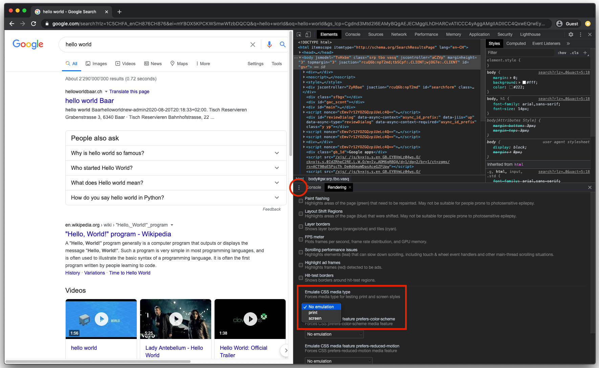
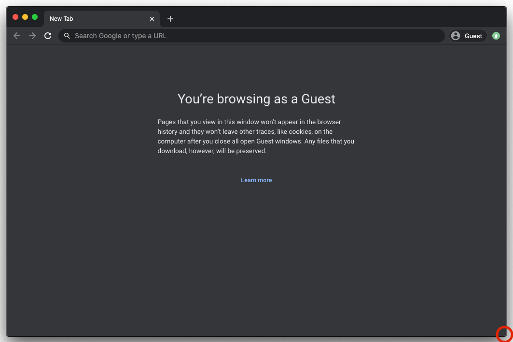

# Responsive Web Design

## Inhalt

* [Intro](#intro)
* [Der Viewport](#der-viewport)
* [Media-Queries](#media-queries)
* [Testing](#testing)

## Setup

Für Übungen nutzen wir die folgende **CodeSandbox** als Startpunkt:

**[https://codesandbox.io/s/j611l](https://codesandbox.io/s/j611l)**

Die Übungen bauen immer aufeinander auf. Aber keine Angst! Für den Fall, dass bei einer Übung etwas nicht klappt, gibts bei jeder Übung einen Link zur CodeSandbox mit dem aktuellen Stand.

## Intro

Man kann nicht wissen, von welchem Device ein User auf eine Website geht, daher ist es wichtig, dass Websites responsive sind, sodass die Website sich dem Device anpassen kann um dem User immer eine möglichst gute User Experience zu bieten. Dies nennt man Responsive Web Design (RWD).


Source: https://miro.medium.com/max/1626/1*3hQ4krP-rTql7IK0B4-yZQ.gif

## Der Viewport

Damit eine Website responsive wird, wird vor allem eines benötigt. Dem Browser muss mitgeteilt werden, dass die Website, auf die er zugreift, auch wirklich responsive ist.
Dafür gibt es einen `meta`-Tag, den man nutzen kann.

**Beispiel**

```html
<meta name="viewport" content="width=device-width, initial-scale=1.0">
```

### Verfügbare Attribute

|Attribut|Werte|Beschreibung|
|---|---|---|
|`width`|Positiver Integer oder der Wert `device-width`|Definiert die Breite des Viewports in `px`|
|`height`|Positiver Integer oder der Wert `device-height`|Definiert die Höhe des Viewports in `px`|
|`initial-scale`|Positive Nummer zwischen `0.0` und `10.0`|Definiert das initiale Verhältnis zwischen Device und Viewport|
|`minimum-scale`|Positive Nummer zwischen `0.0` und `10.0`|Definiert den minimalen Zoom|
|`maximum-scale`|Positive Nummer zwischen `0.0` und `10.0`|Definiert den maximalen Zoom|
|`user-scalable`|`yes` (default) oder `no`|Bei `no` kann der User die Website nicht zoomen|

**Achtung Antipattern** 🚫

`user-scalable=no` anzugeben gilt als Antipattern, da Usern mit einer Sehschwäche die Möglichkeit genommen wird, die Website zu zoomen.  
`maximum-scale` sollte mindestens auf `5.0` (empfohlen von Google) gesetzt werden aus dem gleichen Grund.

**Beispiel mit HTML-Grundgerüst**

```html
<!DOCTYPE html>
<html lang="en">
  <head>
    <meta charset="UTF-8">
    <meta name="viewport" content="width=device-width, initial-scale=1.0">
    <title>Beispiel mit HTML-Grundgerüst</title>
  </head>
  <body>
    <h1>Hello World</h1>
  </body>
</html>
```

**Demo** 🤯

- [Viewport Metatag](https://codesandbox.io/s/uqvf1)

**Einschub: CSS Pixel und Device Pixel** 👀

Mitlerweile haben fast alle mobilen Geräte ein Pixelratio von mehr als 1:1. Das heisst grundsätzlich, dass 1 CSS Pixel 'mehr' ist als nur 1 Device Pixel.  
Ein iPhone 6 hat eine native Auflösung von `750px` x `1334px`, aber es besitzt ein Pixelratio von 2:1 (retina Display). Im Browser haben wir aber 'nur' `375px` Breite zur Verfügung. Das Betriebsystem gibt dann das Pixelratio vor, welches dann die CSS Pixel berechnet und diese Info an den Browser weitergibt. **Grundsätzlich sind alle Units, die eine Weite beschreiben, auf die CSS Pixel bezogen, nicht auf die Device Pixel**.

**Hilfreiche Links**

* [Understanding the Difference Between CSS Resolution and Device Resolution](https://medium.com/@elad/understanding-the-difference-between-css-resolution-and-device-resolution-28acae23da0b)
* [Retina Display Media Query](https://css-tricks.com/snippets/css/retina-display-media-query/)
* [Github Gist examples](https://gist.github.com/garzito/3830434)

## Media-Queries

### Vorwort

Grundsätzlich gibt es fürs RWD zwei Grundprinzipien.

1. Im Layout sollte vermehrt mit `%` gearbeitet werden
2. Mit **Media-Queries** ermöglichen wir, dass wir CSS-Deklarationen abhängig von bestimmten Kriterien wieder überschreiben können

### Syntax

Ein Media Query beinnt mit einem `@media`, auch 'at-rule' genannt. Danach folgen ein optionaler `media-type` und null bis mehrere `media-feature`.

```css
@media [media-type] [and [(media-feature)]] {
  /*...*/
}
```

**Beispiel**

```css
@media screen and (min-width: 600px) {
  /*...*/
}
```

Was dies genau heisst ist: "Wenn wir uns auf einem `screen` befinden, und dieser mindestens `600px` breit ist, wende das folgende CSS an"

`media-type` und `media-feature` sind beide optional, das heisst, dass die folgenden Media-Queries beide valid sind.

```css
@media screen {
  /*...*/
}
```

```css
@media (min-width: 600px) {
  /*...*/
}
```

### Media Types

Der Media Type wird genutzt um das Medium zu beschreiben wie die Website konsumiert wird:

* `all` &rightarrow; Default value
* `screen` &rightarrow; Wird angewendet, wenn das Medium einen Bildschirm hat _(normal)_
* `print` &rightarrow; Wird angewendet, wenn die Website gedruckt wird
* `speech` &rightarrow; Wird angewendet, wenn z.B. einen Screenreader/[SpeechRecognition](https://developer.mozilla.org/en-US/docs/Web/API/SpeechRecognition) benutzt wird (leider selbst noch keine Erfahrung und ist bis aktuell auch noch in keinem Browser integriert).

Weitere media Types in der offiziellen [Dokumentation](https://www.w3.org/TR/mediaqueries-5/#media-types) (werden aber nie genutzt).

**Einschub: Media Type emulieren** 👀

Der Media Type kann emuliert werden, so könnt ihr anhand der Devtool schauen, wie die Website z.B. beim Druck aussehen würde.



### Media Features

Fürs Responsive Web Design wird vor allem das *dimension* Feature genutzt.

#### `width` und `height`

Es können die exakte `width`, `min-width` und `max-width`, und die exakte `height`, `min-height` und `max-height` genutzt werden.  
Am meisten werden jeweils `min-*` und `max-*` genutzt.

**Beispiele**

```css
@media (min-width: 600px) {
  /*...*/
}

@media (max-height: 1000px) {
  /*...*/
}
```

**Best Practises** ✅

Alle *dimension* Features unterstützen die regulären CSS Units wie `px`, `em`, usw. Es wird jedoch empfohlen, dass innerhalb von Media-Queries `px` genutzt wird. Dadurch werden User benachteiligt, welche die default `font-size` ihres Browsers angepasst haben, da `px` nicht damit skaliert. Jedoch gibt es einen Bug im Safari, welches `em` in Media-Queries nicht richtig berechnet, wenn der User gleichzeitig einen aktiven Zoom hat. Hier der [Bug als Demo](https://codesandbox.io/s/demo-safari-em-yvoft?file=/index.html).

**Hilfreiche Links**

* [Media Query Spezifikation (official)](https://www.w3.org/TR/mediaqueries-5/#media)
* [Media Features Spezifikation (official)](https://www.w3.org/TR/mediaqueries-5/#mf-viewport-characteristics)
* [`@media` MDN](https://developer.mozilla.org/en-US/docs/Web/CSS/@media)

### Logische Operatoren

#### Der `and` Operator

Man kann den `and` Operator zwischen verschiedenen `media-type` und `media-feature` nutzen, um diese beliebig zu verbinden.

**Beispiele**

```css
@media screen and (min-width: 600px) {
  /*...*/
}

@media (min-width: 400px) and (max-width: 800px) {
  /*...*/
}

@media screen and print and (min-width: 800px) and (max-width: 1200px) {
  /*...*/
}
```

#### Der **oder** Operator: `,` (ein Komma)

Der oder Operator wird genutzt um mehrere Media-Queries zu deklarieren, die das gleiche CSS anwenden. Jeder vom `,` getrennte Wert ist dabei ein eigenständiger Media Query und sobald ein Media Query davon zutrifft, wird das CSS angewendet.

**Beispiele**

```css
@media screen, print {
  /*...*/
}

@media screen and (min-width: 1200px), (max-width: 800px) {
  /*...*/
}

@media screen and (max-width: 400px), (min-width: 800px) and (max-width: 1200px) {
  /*...*/
}
```

#### Der `not` Operator

Mit dem `not` Operator kann man einen **ganzen** Media Query negieren. Solange dieser nicht zutrifft, wird das CSS angewendet.
Mit diesem Operator muss ein `media-type` angegeben werden, damit dieser valid ist.

**Beispiel**

```css
@media not screen {
  /*...*/
}

@media not all and (max-width: 800px) {
  /*...*/
}
```

### Nesting

Media-Queries können auch ineinander verschachtelt werden.

**Beispiel**

```css
/* Anstatt */
@media (min-width: 800px) and (max-width: 1200px) {
  /*...*/
}

/* Kann dies auch so geschrieben werden */
@media (min-width: 800px) {
  @media (max-width: 1200px) {
    /*...*/
  }
}
```

> **Note:** Das Verschachteln von Media-Queries wird grundsätzlich nicht genutzt, wird aber von Browsern unterstützt

**Demo** 🤯

- [Nesting Media Queries](https://codesandbox.io/s/m030w)

### Media-Queries im HTML

In einem `<link>` können Media-Queries ebenfalls verwendet werden.

**Beispiel**

```html
<link href="style.css" rel="stylesheet" media="screen and (min-width: 400px)" />
```

**Achtung Antipattern** 🚫

Dies ist zwar möglich, sollte aber trotzdem nicht verwendet werden. Jede verlinkte CSS-Datei wird heruntergeladen, egal ob der Media Query zutrifft oder nicht. Der Media Query wird dabei erst evaluiert, wenn die Datei heruntergeladen ist.

### Practice 🔥

Öffne diese [**CodeSandbox**](https://codesandbox.io/s/j611l) als Startpunkt.

- [ ] Unter `30em` Breite, sollten alle Container untereinander sein
- [ ] Ab `30em` und unter `50em` Breite, sollten die Navigation und die Sidebar jeweils `20%` Breite des Elternelements einnehmen
- [ ] Ab `50em` Breite sollten di Navigation und die Sidebar jeweils `15%` Breite des Elternelementes einnehmen
- [ ] Der `.wrapper` sollte horizontal zentriert sein, sobald dieser seine `max-width` erreicht hat
- [ ] Strukturiere dein CSS, sodass nur `(min-width: xxx)` media Queries genutzt werden
 
Zeit: ~ 15 min

**Solution**: [https://codesandbox.io/s/xfy1p](https://codesandbox.io/s/xfy1p)

## Testing

Die einfachste Form vom Testing von Responsive Websites ist, den Browser kleiner und grösser zu machen.



Die effektivste Form vom Testing von Responsive Websites ist jedoch mit den Dev-Tools. Dort kann man den Device-Modus aktivieren um div. Sachen zu emulieren.  
Custom `width` und `height` sind nur die Oberfläche, man kann damit ein Gerät emulieren, das Pixelratio verändern und noch vieles mehr.

  
_Beispiel: Chrome Dev-Tools_

### Practice 🔥

Öffne diese [**CodeSandbox**](https://q3i51.csb.app/) als Startpunkt.

- [ ] Simuliere ein iPhone10
- [ ] Simuliere mit den Dev-Tools ein Pixelratio von mindestens 3.0, damit der Hintergrund der Website grün wird
- [ ] Schalte ein, dass alle Media-Queries angezeigt werden

Zeit: ~ 5 min

**Hilfreiche Links**

* [What is Mobile First Design?](https://medium.com/@Vincentxia77/what-is-mobile-first-design-why-its-important-how-to-make-it-7d3cf2e29d00)
* [Complete Guide to Responsive Images!](https://medium.com/@elad/a-complete-guide-for-responsive-images-b13db359c6c7)
* [Accessible, Simple, Responsive Tables](https://css-tricks.com/accessible-simple-responsive-tables/)
* [Responsive web design tricks and tips](https://webflow.com/blog/responsive-web-design-tricks-and-tips)

**Einschub: Feature-Queries** 👀

Mit `@supports` kann man prüfen, ob bestimmte Deklarationen unterstützt werden.

**Beispiele**

```css
@supports (display: grid) {
  .grid-container {
    /* display: grid; can be used here */
  }
}
```

**Hilfreiche Links**

* [Feature Queries Spezifikation (official)](https://www.w3.org/TR/css-conditional-3/#at-ruledef-supports)