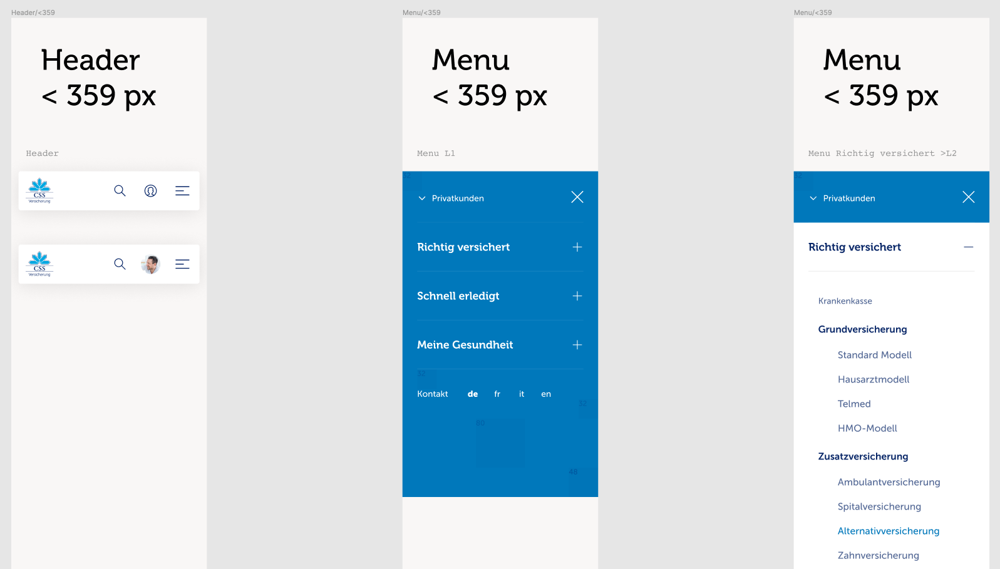
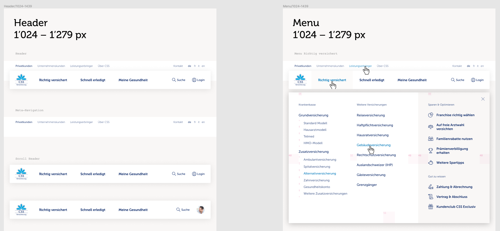

# Vue.js slots

## Inhalt

* [Intro](#intro)
* [Vue.js Miniintro](#vue.js-miniintro)
* [Vorteile von Vue.js](#vorteile-von-vue.js)
* [Nutzung im Header](#nutzung-im-header)

## Intro

Den Header von css.ch wollten wir so implementieren, dass von seitens SEO keine penalties bestehen, aber wir wollten ebenfalls die Power eines Frontend-Frameworks wie React oder [Vue.js](https://vuejs.org/) nutzen. Bei diesem Projekt hatten wir uns bereits für Vue.js entschieden, daher wurde der Heade ebenfalls damit umgesetzt.

## Vue.js Miniintro

### Was ist Vue.js?

> Vue (pronounced /vjuː/, like **view**) is a **progressive framework** for building user interfaces. Unlike other monolithic frameworks, Vue is designed from the ground up to be incrementally adoptable. The core library is focused on the view layer only, and is easy to pick up and integrate with other libraries or existing projects. On the other hand, Vue is also perfectly capable of powering sophisticated Single-Page Applications when used in combination with modern tooling and supporting libraries.

### Quickstart

Der einfachste Weg zum starten ist, Vue.js vom CDN einbinden, und man kann es verwenden.

```html
<!-- development version, includes helpful console warnings -->
<script src="https://cdn.jsdelivr.net/npm/vue@2/dist/vue.js"></script>
```

oder

```html
<!-- production version, optimized for size and speed -->
<script src="https://cdn.jsdelivr.net/npm/vue@2"></script>
```

**Example**

```html
<!DOCTYPE html>
<html>
<head>
  <title>My first Vue app</title>
  <script src="https://unpkg.com/vue"></script>
</head>
<body>
  <div id="app">
    {{ message }}
  </div>

  <script>
    var app = new Vue({
      el: '#app',
      data: {
        message: 'Hello Vue!'
      }
    })
  </script>
</body>
</html>
```

**Demo** 🤯

- [Hello Vue!](https://codesandbox.io/s/github/vuejs/vuejs.org/tree/master/src/v2/examples/vue-20-hello-world)

### Nutzung per npm

Vue.js kann auch als npm-package genutzt werden. Dafür muss `npm install vue` ausgeführt werden, danach kann vue importiert werden.

```js
// main.js
import Vue from 'vue';

const app = new Vue({
  el: '#app',
  data: {
    message: 'Hello Vue!'
  }
})
```

### Components

Vue.js ist gleich wie andere MV*-Frameworks so aufgebaut, dass man sein Widget/Webapp oder ähnliches in verschiedenen Komponenten aufsplitten kann. Diese kann man ebenfalls ineinander verschachteln. Damit man diese im Template nutzen kann, müssen diese bei Vue registriert werden.


*Source: https://vuejs.org/images/components.png*

Einene Komponenten **global** registrien:

```js
// Definiert einen neuen Komponent todo-item
Vue.component('todo-item', {
  template: '<li>This is a todo</li>'
})

var app = new Vue(...)
```

Sobald dieser registriert ist, können wir von irgendeiner Vue-Instanz diesem im Tempalte nutzen:

```html
<ol>
  <!-- Erstellt eine Instanz unseres todo-item Komponenten -->
  <todo-item></todo-item>
</ol>
```

**Hilfreiche Links**

* [Getting started Guide](https://vuejs.org/v2/guide/)
* [Composing with Components](https://vuejs.org/v2/guide/index.html#Composing-with-Components)
* [Single File Components](https://vuejs.org/v2/guide/single-file-components.html)

## Vorteile von Vue.js

Der grösste Unterschied zwischen React und Vue.js ist, dass Vue.js auch mit einem Template umgehen kann, welches sich im DOM befindet. Dabei muss das Template nicht in einem Vue-Komponenten integriert werden. **Es ist aber auch möglich in unserem DOM slots zu verwenden**. Wir können also im HTML bereits das Template schreiben und anschliesslichd unseren Vue-Komponenten darüber mounten. Somit kann das Backend den Header bereits mit allen nötigen Strukturen rendern, damit wir für SEO keine penalities haben, wenn z.B. die Navigation im Header erst auf dem Client gerendert werden würde. Zudem haben wir die Power von Vue.js zur Verfügung, damit wir die Funktionalität des Headers nicht in *vanilla* schreiben müssen.

### Problem: Das Markup des Mobilen Headers ist nicht zu 100% verwendbar für den Desktop Header

Beim genaueren betrachten des Design, fiel auf, dass es nicht möglich war das HTML so aufzubereiten, dass das gleiche Markup für die Mobile-Ansicht, sowie auch für die Desktop-Ansicht verwendet werden kann. Auf mobile mussten wir es anders strukturieren, damit die Elemente richtig dargestellt werden konnten.

**Design Mobile**



**Design Desktop**



### Slots

Wir hatten also die Anforderung, dass alles SEO-relevante vom Backend gerendert werden muss (komicshcer Satz!), aber auch, dass das Markup so aufgebaut ist, dass es auf Mobile und Desktop verwendet werden kann. Die Lösung für das Problem waren [`slots`](https://vuejs.org/v2/guide/components-slots.html). Wir schauen uns die Slots genauer an.

Hier können wir einen Komponenten nutzen und einen Content mitgeben.  
Der Inhalt / Children in dem Komponenten werden innerhalb des Komponenten an dem Ort gerendert, wo `<slot/>`

**Example**

```html
<!-- Parent Component -->
<navigation-link url="/profile">
  <svg-icon name="user"></svg-icon>
  Your Profile
</navigation-link>
```

```html
<!-- navigation-link.vue -->
<a v-bind:href="url" class="nav-link">
  <slot/> <!-- Your Profile -->
</a>
```

#### Named slots

Wenn man mehrere Slots verwenden will, kann man named slots verwenden.

**Example**

```html
<!-- Parent Component -->
<base-layout>
  <template v-slot:header>
    <h1>Here might be a page title</h1>
  </template>

  <p>A paragraph for the main content.</p>
  <p>And another one.</p>

  <template v-slot:footer>
    <p>Here's some contact info</p>
  </template>
</base-layout>
```

```html
<!-- base-layout.vue -->
<div class="container">
  <header>
    <slot name="header"></slot>
  </header>
  <main>
    <slot></slot>
  </main>
  <footer>
    <slot name="footer"></slot>
  </footer>
</div>
```

#### Scoped Slots

Scoped slots ermöglichen uns, dass wir Daten/Funktionen, etc. auf dem Childcomponent herausheben und im Parentcomponent verwenden.  
Im folgenden Beispiel übergeben wir im `base-layout.vue` Komponent

**Example**

```html
<!-- Parent Component -->
<base-layout>
  <template v-slot:header="slotProps">
    <h1>{{ slotProps.somePropName }}</h1>
  </template>
</base-layout>
```

```html
<!-- base-layout.vue -->
<div class="container">
  <header>
    <slot name="header" v-bind:somePropName="'Hello World'"></slot>
  </header>
</div>
```

**Rendered HTML**

```html
<div class="container">
  <header>
    <h1>Hello World</h1>
  </header>
</div>
```

## Nutzung im Header

Diese Scoped Slots Mechanik ist extremst nützlich für uns. In unserem Childcomponent können wir die komplette Funktionalität sowie den State von dem Header implementieren, und dann diesen per Slotprops an unser vom Backend gerendertes Template übergeben.

**CSS Header Template**

```html
<header class="l-header" data-module="header" role="banner">
  <div class="header-fixed-wrapper" ref="fixed-wrapper" :class="wrapperClasses">
    <div class="header-grid vue-loading" is="responsive-switch"
      default-component="header-mobile"
      :components="{ 'header-desktop': ['large', 'wide', 'ultra', 'epic', 'orbit']}"
      :data="{ 'initialBusinessArea': 0 }">
      <div class="header-bar"></div>
      <div class="c-header-logo header-logo"> ... </div>
      <div class="c-super-nav header-super-nav" slot="super-nav" slot-scope="slotProps">
        <label class="sr-only" for="super-nav-select">Geschäftsbereich wählen</label> 
        <select class="c-super-nav__select" name="super-nav" id="super-nav-select"
          @change="slotProps.onBusinessAreaChange">
          <option value="privatkunden" selected="selected">Privatkunden</option>
          <option value="unternehmenskunden">Unternehmenskunden</option>
          <option value="leistungsbringer">Leistungsbringer</option>
          <option value="ubercss">Über CSS</option>
        </select>
        <nav class="c-super-nav__nav">
          <ul class="c-super-nav__list">
            <li class="c-super-nav__item" aria-owns="main-nav-privatkunden">
            <a class="c-super-nav__link is-active" href="#">
              <span class="sr-only">Aktiver Geschäftsbereich::</span> Privatkunden
            </a>
            </li>
            <li class="c-super-nav__item"> <a class="c-super-nav__link" href="#"> Unternehmenskunden </a> </li>
            <li class="c-super-nav__item"> <a class="c-super-nav__link" href="#"> Leistungsbringer </a> </li>
            <li class="c-super-nav__item"> <a class="c-super-nav__link" href="#"> Über CSS </a> </li>
          </ul>
        </nav>
      </div>
      <div class="c-meta-block header-meta-block" slot="meta-block"> ... </div>
      <nav role="navigation" class="c-main-nav header-main-nav" slot="main-nav" slot-scope="slotProps"> ... </nav>
      <div class="c-service-block header-service-block" slot="service-block" slot-scope="slotProps"> ... </div>
      <div data-module="notification-modal"></div>
    </div>
  </div>
  <div class="header-spacer"></div>
</header>
```

Im Template verwenden wir den `responsive-switch` Komponent. Er ermöglicht uns, dass wir verschiedene Vue-Komponenten rendern können, abhängig vom Breakpoint auf dem wir uns aktuell gerade befinden.

Dadurch haben wir die Möglichkeit, dass wir einen `HeaderMobile.vue` haben und ein `HeaderDesktop.vue`. Die geteilten Funktionalitäten werden ausgelagert, sodass diese in beiden Komponenten verwendet werden können. Wir schauen uns heute die Templates der beiden Komponenten an.

**HeaderDesktop.vue Template**

```html
<template>
  <div>
    <slot name="super-nav" v-bind:onBusinessAreaChange="() => {}"></slot>
    <slot name="meta-block"></slot>

    <slot></slot>

    <slot name="main-nav"
      v-bind:levelOneClick="levelOneClick"
      v-bind:levelOneMouseenter="levelOneMouseenter"
      v-bind:levelOneMouseleave="levelOneMouseleave"
      v-bind:activeBusinessArea="activeBusinessArea"
      v-bind:dynamicBusinessAreas="dynamicBusinessAreas"
      v-bind:onMegadropdownTransitionend="onMegadropdownTransitionend"
      v-bind:onCloseClick="onCloseClick"
      v-bind:onKeyDown="onKeyDown"
      v-bind:onFocus="onFocus"
    />
    <slot name="service-block" v-bind:burgerClick="() => {}"></slot>
  </div>
</template>
```

**HeaderMobile.vue Template**

```html
<template>
  <div>
    <slot></slot>

    <slot name="service-block"
      v-bind:burgerClick="burgerClick"
      v-bind:overlayOpen="overlayAttributes.displayed"
    />

    <div class="c-header-overlay"
      v-bind:aria-hidden="overlayAttributes.displayed ? 'false' : 'true'"
      v-bind:class="{ 'is-open': overlayAttributes.displayed, 'is-entering': overlayAttributes.entered }"
      v-on:transitionend="overlayTransitionendHandler"
    >
      <div class="c-header-overlay__inner c-header-overlay__inner--with-divider" ref="overlay-fixed">
        <button ref="closeButton" class="c-header-overlay__close-btn"
          aria-expanded="overlayAttributes.displayed ? 'true' : 'false'" type="button" v-on:click="closeOverlay">
          <svg class="c-icon c-icon-close c-icon--20" focusable="false">
            <use xlink:href="/assets/images/svg-sprite.svg#sprite-close"></use>
          </svg>
          <span class="sr-only">Menu schliessen</span>
        </button>

        <slot name="super-nav" v-bind:onBusinessAreaChange="onBusinessAreaChange"></slot>
      </div>

      <div class="c-header-overlay__scrollcontainer" ref="overlay-scrollable">
        <div class="c-header-overlay__scrollcontainer-inner">
          <slot name="main-nav"
            v-bind:levelOneClick="levelOneClick"
            v-bind:levelOneMouseenter="() => {}"
            v-bind:levelOneMouseleave="() => {}"
            v-bind:activeBusinessArea="activeBusinessArea"
            v-bind:dynamicBusinessAreas="dynamicBusinessAreas"
            v-bind:onMegadropdownTransitionend="onMegadropdownTransitionend"
            v-bind:onCloseClick="() => {}"
            v-bind:onKeyDown="() => {}"
            v-bind:onFocus="() => {}"
          />

          <div class="c-header-overlay__inner">
            <slot name="meta-block"></slot>
          </div>
        </div>
      </div>
    </div>
  </div>
</template>
```

Im Template des HeaderMobile.vue ist die Grundstruktur des Templates anders, damit wir die Navigation ins Overlay verschieben können. Dies ist nur machbar durch die Funktionalität der Scoped Slots in Vue.js.
