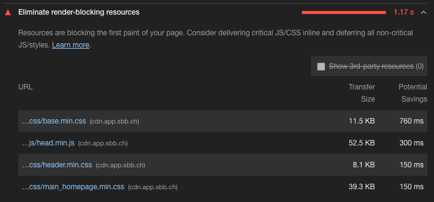
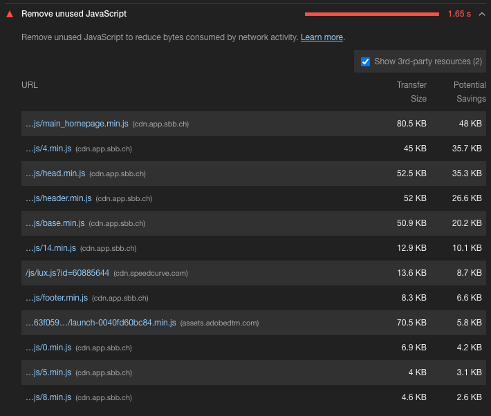
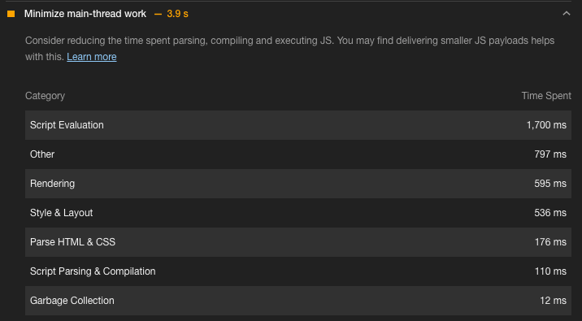
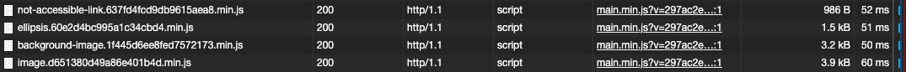
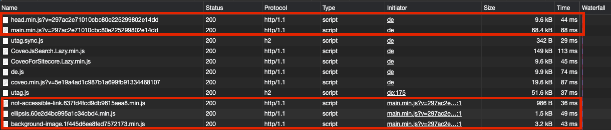
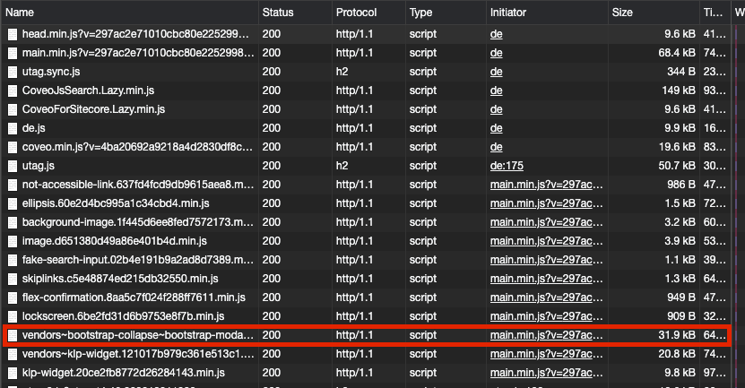

# Eine solide JavaScript-Architektur erstellen

## Inhalt

* [Intro](#intro)
* [Challenges](#challenges)
* [Vorbereitung / Requirements definieren](#vorbereitung-requirements--definieren)
* [Umsetzung](#umsetzung)
* [Weiteres](#weiteres)

## Intro

Eine JavaScript-Architktur nennt man vor allem den Aufbau und das Organisieren vom eigenen JavaScript.
Es geht zum Teil so weit, dass ein eigenes kleines Miniframework aufgebaut wird. Es sollte den Entwicklern das Leben vereinfachen, sodass diese sich nicht um die Basics kümmern müssen.

### Projekt Infos

Als Beispiel wird der Relaunch von [css.ch](https://www.css.ch) genommen.
**Das Frontend wird anhand einer Frontend-Preview erstellt und die Frontend Komponenten werden danach von Hand ins CMS eingepflegt, sodass diese als Module verwendet werden können.**

**Team**

* 1 UX Architect / IA
* 2 UX Designer
* ~6 Frontender
* ~5 Backender

## Challenges

Typische Challenges, die bei einer weniger gut optimierten JavaScript Architektur auftreten können, sind die folgenden:

### Render-Blocking

Render-Blocking Ressourcen verhindern, dass auf der Website etwas gerendert werden kann. Dies geschiet vor allem, wenn JavaScript- & CSS-Dateien im `<head>` verlinkt sind und diese nicht asynchron geladen werden.



### Nicht genutztes JavaScript wird an den Client ausgeliefert

Wenn nicht genutzten JavaScript an den Client ausgeliefert wird, heisst das grundsätzlich, dass der Browser dies 1. Runterladen muss, aber auch das decodieren und parsen der JavaScriptdatei hat seine Zeit. Das Heisst, wenn man dies verhindern könnte, würde der Browser in dieser Hinsicht entlastet werden.



**Caveat**
Wenn der Browser etwas als "unused" erkennt, heisst das nicht automatisch, dass man dies um jeden Preis aus seinem JavaScript entfernen muss, es ist lediglich ein Hinweis, dass ein Teil dieses JavaScripts bei der Messung nicht ausgeführt wurde.
Ergo, wenn z.B. steht, dass **10%** unused ist, ist es generell nicht umbedingt ein Problem. Wenn jedoch z.B. **50%** nicht genutzt wurden, ist dies sicherlich ein Problem und sollte genauer angeschaut werden.

**Hilfreiche Links**

* [Remove unused code](https://web.dev/remove-unused-code)

### Main-Thread muss aussergewöhnlich viel JavaScript ausführen

Es werden oftmals direkt nach dem Pageload div. JavaScript-Module initialisiert. Oft aber, bräuchte es diese gar noch nicht *above the fold*. Zudem bei Nutzung von Anti-Patterns welche den Main-Thread unnötig beschäftigen, oder diesen gar blockiert (z.B. Layout-Thrashing) kann es massive Verzögerungen geben, bis eine Website responsive ist für Userinput.



**Hilfreiche Links**

* [Minimize main thread work](https://web.dev/mainthread-work-breakdown)

### Dateien werden nicht langzeitig gecacht

Grundsätzlich sollten JavaScript-Dateien *versioniert* sein, damit gleichzeitig das Langzeitcaching, sowie auch die cacheinvalidierung automatisiert ist.
Dies ist leider nicht immer der Fall. Oftmals werden Dateien, die noch valide wären, bereits invalidiert oder Dateien werden gar nicht invalidiert, was zu grösseren Problemen führen kann.

> **Disclaimer**
>  
> * Meist ist es nicht möglich diese Problemstellen komplett zu eliminieren. Mit gewissen Massnahmen können diese Probleme jedoch möglichst minimiert werden.

*Die Screenshots sind vom Lighthouse audit von sbb.ch*

### Practice 🔥

- [ ] Diskutiert in einer 3er oder 4er Gruppe, wie ihr diese Probleme möglichst minimieren könntet.  
      Probiert zu überlegen wie ihr dies in einer SPA angehen könnt, aber auch wie ihr dies in einer Traditionellen Website angehen könntet.

Zeit: ~ 10 min

## Lösungsansätze/Ideen

### Render-Blocking

Grundsätzlich sollte nur das "critical" JavaScript wirklich renderblocking sein. Alles andere **kann und sollte asynchron nachgeladen werden**.

**Best Solution**

Nach dem Identifizieren des kritischen JavaScript Codes, sollte dieser als inline `<script>` Tag direkt im HTML eingebettet werden. Somit hat die Seite alles was sie benötigt, für die *Core-Funktionalität* der Website.  
Alles andere JavaScript, welches nicht direkt beim Pageload benötigt wird, kann weiterhin mit einem `<script src="/path/main.js">` integriert werden. Es sollte aber entweder mit dem Attribut `async` oder `defer`
asynchron geladen werden, damit das rendering nicht blockiert wird.

**Unsere Solution**

Unser kritisches JavaScript, welches für die Core-Funktionalität benötigt wird, wird in eine separate JavaScript-Datei ausgelagert `head.js`. Alles was nicht kritisch eingestuft wird, wird ins `main.js` geschrieben und dieses wird mit `defer` asynchron geladen und nach dem Parsen des HTML ausgeführt.

Zum kritischen JavaScript gehört z.B. **Font-Loading** und **Modernizer**, eventuell **globale Variablen** setzen, etc.

**Begründung**

Eine separate `head.js`-Datei ermöglicht erstens caching, aber noch wichtiger ist, dass es fürs Backend keine Rolle spielt, was in der Datei drin steht.  
Falls das JavaScript inlined werden sollte, muss dies vom Backend unterstützt werden, und zudem muss im Cache vom Backend jede Seite invalidiert werden, wenn etwas im `head.js` ändern würde.

**Hilfreiche Links**

* [Attribute async & defer](https://www.growingwiththeweb.com/2014/02/async-vs-defer-attributes.html)
* [Eliminate render-blocking resources](https://web.dev/render-blocking-resources/)

### Nicht genutztes JavaScript wird an den Client ausgeliefert

Oftmals wird mit einem JavaScript bundler gearbeitet, dieser bundelt das JavaScript für die ganze Website. Den bundler interessiert es nicht, auf welcher Seite die Module integriert sind, er bundlet einfach alles zu einer grossen Datei zusammen. Mit [`dynamic imports`](https://github.com/tc39/proposal-dynamic-import) können wir aus bestimmten Modulen separate chunks generieren und diese nachladen, nur wenn sie wirklich gebraucht werden.

Unser JavaScript sollte daher bestmöglichst aufgesplittet werden, damit auf einer bestimmten Seite nur das JavaScript geladen wird, welches auf dieser Seite wirklich genutzt wird.  
Zudem sollte das Inkludieren eines externen packages z.B. von `npm` nicht nur auf security, sondern auch auf Dateigrösse geprüft werden. Bei einem Import von `lodash` kann es z.B. geschehen, dass das komplette lodash package im eigenen Bundle inkludiert wird (300 KB), was wir nicht wollen.

### Main-Thread muss aussergewöhnlich viel JavaScript ausführen

Die Idee war, dass ein JavaScript-Modul erst initialisiert wird, wenn es wirklich genutzt wird. Wir hatten dafür einen [`IntersectionObserver`](https://developer.mozilla.org/en-US/docs/Web/API/Intersection_Observer_API), genutzt.  
Beim pageload tracken wir Elemente, welche ein `data-module="<module-name>"` haben. Diese Attribute sind unsere Elemente, über welche wir unser Modul mounten werden. Wenn wir jetzt also, die Initialisierung des Moduls verzögern wollen, damit der Main-Thread beim Pageload weniger arbeiten muss, können wir auch einfach dieses Element nach dem Pageload einer IntersectionObserver Instanz hinzufügen und dieser sagt uns wenn das Element in die Nähe des Viewports kommt. Dann können wir dieses initialisieren.

**Hilfreiche Links**

* [Minimize main thread work](https://web.dev/mainthread-work-breakdown)

### Dateien werden nicht langzeitig gecacht

Beim Cashing wollten wir in erster Linie darauf achten, dass unsere Dateien fürs Langzeitcaching genutzt werden können. Dies kann mit dem Contentash gemacht werden. Bei der Webpack-Konfiguration kann der Output so eingestellt werden, dass ein Hash in den Dateiname geschrieben wird anhand des Inhalts der Datei. Wenn der Inhalt sich ändert, ändert sich auf der Hash, wenn aber der Inhalt sich nicht ändert, ändert sich auch der Hash nicht.

**Example**

```
ellipsis.60e2d4bc995a1c34cbd4.min.js
```

## Vorbereitung / Requirements definieren

Vor dem Beginn werden noch die Requirements aufgeschrieben. Somit können wir zum Schluss prüfen, ob unsere neue Architektur alles erfüllt was wir benötigen.

### Helpers

* Globale helper wie resize watcher und scroll watcher sollten als Singleton implementiert werden können
  * Diese sollten in den Modulen einfach verwendet werden können

### Module

**General**

* Module werden über ein HTML-Element initialisizert

**Structure/Loading**

* Müssen direkt im main-bundle integriert werden können
* Müssen als separater chunk geladen werden können (Reduzierung der Payload)
* Müssen lazy initialisiert werden (Entlastung des Main-Thread beim Pageload)

**Practicability**

* Müssen global oder als submodul initialisiert werden können
* Müssen untereinander kommunizieren können
* Müssen mixins verwenden können, damit redundante Funktionalität ausgelagert werden kann
* Müssen eine Konfiguration übers Template entgegennehmen können

**Conveniance**

* Müssen eine klare Struktur beinhalten, damit diese einfach erstellt werden können
* Sollte wenn möglich an die alte Modul-Struktur angelehnt sein, damit der neue Aufbau eines Modules nachvollzogen werden kann

## Umsetzung

### Grundentscheide

#### Factories > Classes

Wir hatten uns im Tean für Factories entschieden anstatt Classes. Es ermöglicht uns besser mit mixins zu arbeiten, also Logik auszulagern welche von mehreren Modulen genutzt wird. Wir dachten, dass dies schwärer werden würde, wenn man sich mit Class-Inheritance auseinander setzen muss. Zudem kann man bei Factories private Variablen nutzen und bei Classes konnte man dies zu dem Zeitpunk noch nicht ([aktuell ist die Proposal in stage 3](https://github.com/tc39/proposal-class-fields#private-fields))

#### Dynamic Imports

Es wird mit dynamic imports gearbeiten um das JavaScript aufzusplitten. Damit dies auf auf IE11 funktioniert, muss Babel richtig eingestellt werden.

#### Polyfills

Polyfills müssen so gut wies geht automatisch integriert werden durch [@babel/preset-env](https://babeljs.io/docs/en/babel-preset-env).
Polyfills für `IntersectionObserver` und `fetch`, werden manuell installiert, aber auch diese sollten nur dann geladen werden, wenn diese benötigt werden.

### Webpack Einstellungen

Damit wir das Caching richtig angehen können, muss webpack richtig konfiguriert werden. Wir hatten uns mit dem Backend abgesprochen und konnten festlegen, dass die Dateien mit dem Contenthash versehen werden.  
Der Contenthash ist ein hash, der anhand der Dateigrösse ermittelt wird. Das heisst, sobald sich etwas in der Datei ändert, wird beim nächsten Build ein anderer Contenthash generiert, ergo invalidiert es den Cache automatisch.



Zudem hat es gegenüber anderen Methoden wie z.B. dem Dateinamen eine Versionsnummer anzuhängen, den Vorteil, dass der Cache wirklich nur dann invalidiert wird, sollte sich der Inhalt der Datei ändern. Wenn sich der Inhalt der Datei nicht ändert, wird beim Build jedes mal aufs neue der gleiche Contenthash generiert.

**webpack.config.js**

```js
{
  // ...
  output: {
    path: path.join(__dirname, './dist'),
    filename: 'assets/scripts/[name].[contenthash].js',
    chunkFilename: 'assets/scripts/async/[name].[contenthash].js',
  }
}
```

**Härteres Caching**

Leider reicht dies alleine meistens nicht, damit der Browser die Dateien wirklich lange Zeit cacht. Der Browser ist trotzdem noch der ultimative Gatekeeper, was im Cache bleibt und was wieder aus dem Cache entfernt wird. Wenn man dies wirklich selbst kontrollieren will, müsste man mit einem **ServiceWorker** den Cache selbst kontrollieren.

**Caveat**

Es sollte immer mit dem Backend abgesprochen werden, da das Backend eventuell keine dynamischen Filenamen zulässt!  
Webpack kann auch einen Report generieren, welcher nach dem Build zur Verfügung steht. Eventuell kann das Backend anhand dieses Reports die Dateinamen in deren Templates dynamisch einfügen.

Bei post.ch wurde dies z.B. nicht gemacht, daher ist ein Unterschied zu sehen bei den Dateien die direkt im Template verlinkt sind, und die Dateien die als asynchrone Chunks von webpack gemanaged werden.



**Hilfreiche Links**

* [Service Workers: an Introduction](https://developers.google.com/web/fundamentals/primers/service-workers)
* [The Offline Cookbook (Jake Archibald)](https://web.dev/offline-cookbook/)

### Filestruktur

```sh
/architecture-poc
|-- /src
|   |-- /helpers
|   |-- /libs
|       |-- /create-app.js
|       |-- /create-module.js
|   |-- /modules
|       |-- /module-x.js
|       |-- /module-y.js
|   |-- main.js
|-- webpack.config.json
```

### Finale Implementation

#### create-app.js

```js
import loadPolyfills from '@/scripts/helpers/polyfills';
import Logger from '@/scripts/helpers/logger';

/**
 * createApp
 * @param {Object} config -
 * @param {Object} config.modules -
 * @return {Object} -
 */
export default ({ modules = {} } = {}) => {
  const state = {
    modules: {},
  };

  /* --- Private methods --- */

  /**
   * loadModule
   * @param {Object} module - Module to load
   * @return {Promise<void>} Resolved when loaded
   */
  const loadModule = (module) => {
    const queue = [];

    if (module.features) {
      queue.push(loadPolyfills(module.features));
    }

    if (module.handler instanceof Function) {
      Logger.getInstance().debug('Module Loaded: ' + module.name);

      queue.push(
        module.handler().then((esModule) => {
          // eslint-disable-next-line no-param-reassign
          module.handler = esModule.default;
        }),
      );
    }

    return Promise.all(queue);
  };

  /**
   * createModuleInstance
   * @param {Object} module -
   * @param {HTMLElement} el -
   * @return {undefined} -
   */
  const createModuleInstance = (module, el) => {
    try {
      const dataOptions = el.getAttribute(`data-${module.name}-options`); // Deprecated
      const scripOptions = el.querySelector(
        `script[data-${module.name}-options]`,
      );

      const options = dataOptions
        ? JSON.parse(dataOptions)
        : scripOptions
        ? JSON.parse(scripOptions.textContent)
        : {};

      const instance = module.handler.createInstance({
        el,
        options,
      });

      // Save newly created instance
      module.instances.push({ el, name: module.name, instance });
    } catch (error) {
      throw new Error(
        'Module instantiation failed for module: ' + module.name + '\n' + error,
      );
    }
  };

  /**
   * createIntersectionObserver
   * @param {Object} module -
   * @return {IntersectionObserver} intersectionObserver
   */
  const createIntersectionObserver = (module) => {
    const config = {
      rootMargin: '500px 0px 500px', // Extends IntersectionObserver by 500px on top and on bottom of viewport
      threshold: 0.01,
    };

    const observer = new IntersectionObserver(async (entries) => {
      const elements = entries.filter(
        (entry) => entry.intersectionRatio >= 0.01,
      );

      if (elements.length) {
        await loadModule(module);

        elements.forEach((entry) => {
          createModuleInstance(module, entry.target);

          console.log('unobserve....');
          observer.unobserve(entry.target);
        });
      }
    }, config);

    return observer;
  };

  /* --- Public methods --- */

  /**
   * registerModule
   * @param {String} name - Name of the registered module
   * @param {Object|Function} module - Dynamic import of the module, or module itself
   * @return {Boolean} -
   */
  state.registerModule = (name, module) => {
    const selector = `[data-module~="${name}"]`;

    state.modules[name] = {
      name,
      selector,
      lazy: !!module.lazy, // Assign lazy when module should be lazy-initiated
      features: module.features,

      // Assign actual handler when provided an object with lazy prop
      handler: module.handler ? module.handler : module,
      instances: [],

      /**
       * init
       * @param {Document|HTMLElement} scope - Scope of the module that should be initiated.
       * @return {Promise} -
       */
      async init(scope = document) {
        let elements;

        if (scope === document) {
          elements = scope.querySelectorAll(this.selector);
        } else {
          elements = scope.parentNode.querySelectorAll(this.selector);
        }

        if (elements.length) {
          if (this.lazy) {
            if (!this.intersectionObserver) {
              // Creating a scoped IntersectionObserver for this module
              this.intersectionObserver = createIntersectionObserver(this);
            }

            elements.forEach((el) => {
              console.log('observed....');

              this.intersectionObserver.observe(el);
            });
          } else {
            await loadModule(this);

            elements.forEach((el) => {
              createModuleInstance(this, el);
            });
          }
        }
      },
    };
  };

  state.registerModules = (modules_) => {
    Object.entries(modules_).forEach(([name, module]) => {
      state.registerModule(name, module);
    });
  };

  state.initModule = (name, scope = document) => {
    if (!state.modules[name]) {
      throw new Error(`The module '${name}' is not registered.`);
    }
    state.modules[name].init(scope);
  };

  state.initAllModules = () => {
    Object.keys(state.modules).forEach((name) => {
      state.initModule(name);
    });
  };

  /**
   * getModuleInstancesByElement
   * by providing an HTMLElement we search for modules hooked over this node
   * @param {HTMLElement} element -
   * @param {String} [moduleName] -
   * @return {Array} -
   */
  state.getModuleInstancesByElement = (element, moduleName) => {
    if (moduleName) {
      return state.modules[moduleName].instances.filter(
        (mi) => mi.el === element,
      );
    }

    return Object.entries(state.modules).reduce((acc, [, module]) => {
      acc.push(...module.instances.filter((mi) => mi.el === element));
      return acc;
    }, []);
  };

  /**
   * init
   * @return {undefined}
   */
  state.init = async () => {
    await loadPolyfills(['IntersectionObserver']);

    state.registerModules(modules);
    state.initAllModules();
  };

  state.init();

  return state;
};
```

#### create-module.js

```js
/**
 * createModule
 * @param {Object} config
 * @return {Object} module
 */
export default (config) => ({
  createInstance: ({ el, options: options_ = {} }) => {
    const state = {};

    if (config.mixins) {
      Object.entries(config.mixins).forEach(([name, mixin]) => {
        // mixins are namespaced by name and prepended by a '$'
        // This is mainly to avoid naming-conflict
        state[`$${name}`] = mixin();
      });
    }

    const options = {};

    // Check if default options is a function and throw if it's defined but not as a function
    if (config.options && config.options instanceof Function) {
      Object.assign(options, config.options());
    } else if (config.options) {
      throw new Error('options must be a Function returning an object');
    }

    // Assign given options to overwrite default options
    Object.assign(options, options_);

    return config.constructor({
      el,
      state,
      options,
    });
  },
});
```

### main.js
```js
import './helpers/polyfills';

import createApp from './libs/create-app';
import button from '@/scripts/modules/button';
import image from '@/scripts/modules/image';

window.apps = {};
window.apps.main = createApp({
  modules: {
    // Directly integrate module
    button,
    image: {
      features: ['IntersectionObserver', 'picture'],
      handler: image,
    },

    // lazy-load module if it's found in the DOM
    'vue-module': () =>
      import(/* webpackChunkName: "vue-mod" */ '@/scripts/modules/vue-module'),

    // lazy-laod when scrolled to this element
    'lazy-module': {
      lazy: true,
      handler: () =>
        import(
          /* webpackChunkName: "lazy-mod" */ '@/scripts/modules/lazy-module'
        ),
    },
  },
});
```

#### module.js

```js
import createModule from '@/scripts/libs/create-module';

export default createModule({
  options: () => ({
    foo: 'bar',
  }),

  /**
   * createButton
   * @param {Object} module - Module
   * @param {Element} module.el - Element
   * @param {Object} module.state - State
   * @param {Object} module.options - Options
   * @return {Object} state
   */
  constructor({ el, state, options }) {
    /* --- Private methods --- */

    /**
     * clickHandler
     * @param {Event} event - Native Event
     * @return {undefined}
     */
    const clickHandler = (event) => {
      console.log('clicked', event, el);
    };

    /**
     * addEventListeners
     * @return {undefined}
     */
    const addEventListeners = () => {
      el.addEventListener('click', clickHandler);
    };

    /**
     * removeEventListeners
     * @return {undefined}
     */
    const removeEventListeners = () => {
      el.removeEventListener('click', clickHandler);
    };

    /* --- Public methods --- */

    /**
     * init
     * @return {undefined}
     */
    state.init = () => {
      addEventListeners();
    };

    /**
     * destroy
     * @return {undefined}
     */
    state.destroy = () => {
      removeEventListeners();
    };

    state.init();

    return state;
  },
});
```

**Demo** 🤯

- [JavaScript Architektur Demo](https://codesandbox.io/s/o04l7) 🦄

## Weiteres

### Preload hints

Preload hints sollten wenn immer möglichst am Anfang des `<head>`-Tag stehen, damit die Dateien möglichst schnell geladen werden. Wichtig dabei ist, dass diese Dateien ab dem Zeitpunkt des parsens der `<link>`-Tags zwar heruntergeladen werden, der Browser dabei aber nicht blockiert ist.

Das `main.js` ist erst am Ende des body effektiv eingebunden. Preload hints geben dem Browser die Möglichkeit, die Dateien bereits herunter zu laden, bevor er am Schluss des `<body>` ist.

```html
<!doctype html>
<html lang="de" class="no-js">
  <head>
    <link rel="preload" href="/assetsv2/js/main.78asn9d87ahsd0a8snhdzamgs8dmg.min.js" as="script">
    ...

  </head>
  <body>
    <h1>Content</h1>
    ...

    <script src="/assetsv2/js/main.78asn9d87ahsd0a8snhdzamgs8dmg.min.js"></script>
  </body>
</html>
```

#### Webpack Common Chunks

Webpack erkennt selbständig, wenn Dependency X in mehreren verschiedenen chunks besteht, und extrahiert diese in einen separaten chunk.  
Webpack stellt danach sicher, dass der zusätzlich generierte Chunk ebenfalls geladen wird, wenn Dependency X geladen wird.



Im Beispiel sehen wir jQuery, welches von div. asynchronen Chunk genutzt wird. Webpack extrahiert jQuery in einem separaten Chunk. Webpack stellt auch sicher, dass es automatisch geladen wird, wenn ein asynchroner Chunk geladen wird, welcher jQuery importiert.
